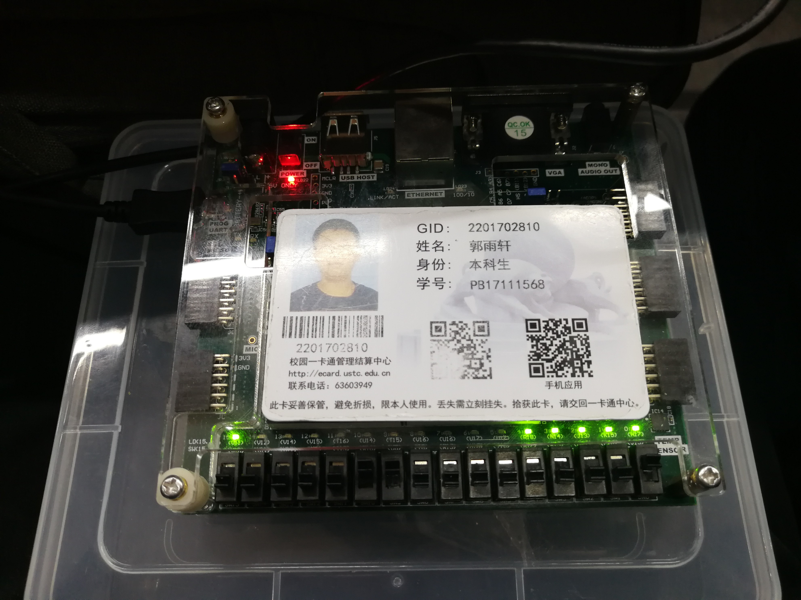
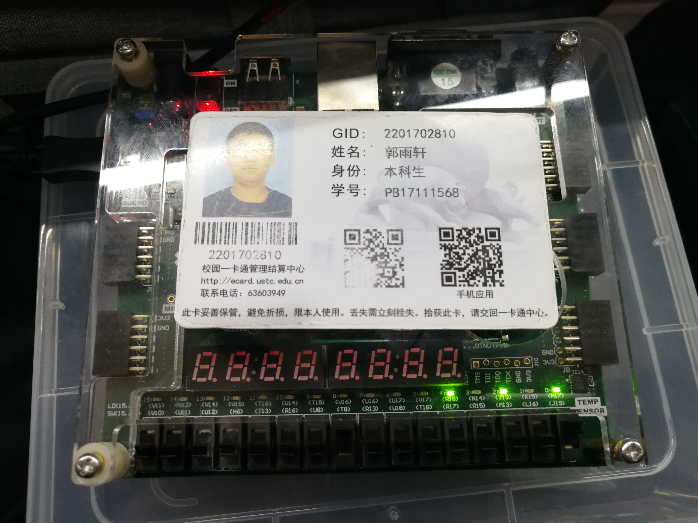

# Lab1 实验报告

## Lab1_1

### 设计思路

- ALU模块有a和b两个6bits宽的输入和3bits的模式选择输入，采用逻辑电路设计，输出位有3位的标志位和6bits宽的结果。其中3bits的标志位分别：f[0]零标志位；f[1]进位位；f[2]溢出位。
- 预先定义各个功能所对应的操作码，在下面的代码中会有所体现。
- 使用4个flag来判定溢出和进位信息，分别为flag1，flag2，flag3，flag4。其中flag1和flag2分别对应加减法中是否最高位是否发生进位，flag3和flag4标志着次高位是否发生进位。当判断是否发生进位/借位的时候，根据进行的运算的类型和flag1和flag2的信息就可以判断是否发生进位/借位，而判断是否发生溢出则需要四个flag的信息才可以判断。

### 实验代码

实验代码如下：

``` verilog
module ALU(
    input [5:0]a,b,
    input [2:0]s,
    output reg [5:0]y,
    output reg [2:0]f
    );
    parameter ADD=3'd0;
    parameter SUB=3'd1;
    parameter AND=3'd2;
    parameter OR=3'd3;
    parameter NOT=3'd4;
    parameter XOR=3'd5;
    reg flag1,flag2,flag3,flag4;
    reg [4:0] t1,t2;
    initial flag1=0;
    initial flag2=0;
    always @ (*)
    begin
        case(s)
            ADD:{flag1,y}=a+b;
            SUB:{flag2,y}=a-b;
            AND:y=a&b;
            OR:y=a|b;
            NOT:y=~a;
            XOR:y=a^b;
            default:y=0;
        endcase
    end
    
    always @ (*)
    begin
        {flag3,t1}=a[4:0]+b[4:0];
        {flag4,t2}=a[4:0]+~b[4:0]+1;
    end
    
    always @ (*)
    begin
        if (y==0)
            f[0]=1;
        else
            f[0]=0;
    end
    
    always @ (*)
    begin
        if (s==ADD)
        begin
            if (flag1==1)
                f[1]=1;
            else
                f[1]=0;
            if (flag1^flag3==1)
                f[2]=1;
            else 
                f[2]=0;
        end
        else if (s==SUB)
        begin
            if (flag2==1)
                f[1]=1;
            else
                f[1]=0;
            if (flag2^flag4==1)
                f[2]=1;
            else 
                f[2]=0;
        end
        else
        begin
            f[1]=0;
            f[2]=0;
        end
    end
endmodule
```

实验testbench代码如下：

``` verilog
module ALU_tb(
    
);
    reg [5:0]a,b;
    reg [2:0]s;
    wire [5:0]y;
    wire [2:0]f;
    initial
    begin
        a=6'd0;
        a=6'b111111;
        #30;
        a=6'b110010;
        #30;
        a=6'b010010;
        #30;
        a=6'b100000;
        #30;
    end

    initial 
    begin
        b=6'd0;
        b=6'b101001;
        #30;
        b=6'b011001;
        #30;
        b=6'b101000;
        #30;
        b=6'b000001;
        #30;
    end

    integer k=0;
    initial 
    begin
        for (k=0;k<5;k=k+1)
        begin
            s=3'd0;#5;
            s=3'd1;#5;
            s=3'd2;#5;
            s=3'd3;#5;
            s=3'd4;#5;
            s=3'd5;#5;
        end
    end
    
    ALU U (a,b,s,y,f);
endmodule
```


### 仿真和下载截图

仿真截图如下：


下载截图如下：



### 硬件资源


### 结果分析

从结果可以看出，当进行加减计算的时候，可以正确的得出结果，并且对于有符号数和补码数对应的进位/借位位和溢出位都可以显示正确的结果，实验截图中验证的是一个临界的条件。

## Lab1_2

### 设计思路

- 寄存器的设计思路比较简单，只需要在时钟沿到来的时候检测写入信号是否有效，若有效则将新的数字写入寄存器即可。

### 实验代码

``` verilog
module REG(
    input [7:0] in,
    input en,rst,clk,
    output [7:0]out
    );
    reg [7:0]tmp;
    always @ (posedge clk or posedge rst)
    begin
        if (rst)
            tmp=8'b00000000;
        else
        begin
            if (en)
            begin
                tmp=in;
            end
            else
            begin
                tmp=tmp;
            end
        end
    end
    assign out=tmp;
endmodule
```

## Lab_1_3_1

### 设计思路

- 由于比较器输入的数字既可能是有符号数又有可能是无符号数，所以给出了6个输出的端口分别代表有符号数和无符号数两种情况。
- 对于无符号数，只需要简单的比较大小来判断，若对于有符号数，我才用了将两个有符号数先进行符号扩展之后再相减判断符号位来进行大小比较，这样就可以避开溢出的情况了。

### 实验代码

``` verilog
module CMP(
    input [7:0]a,b,
    output reg u_big,u_equ,u_lit,
    output reg s_big,s_equ,s_lit
    );
    
    reg [8:0]tmp;
    always @ (*)
    begin
        if (a==b)
            {u_big,u_equ,u_lit}=3'b010;
        else if (a>b)
            {u_big,u_equ,u_lit}=3'b100;
        else
            {u_big,u_equ,u_lit}=3'b001;
    end
    
    always @ (*)
    begin
        if (a==b)
            {s_big,s_equ,s_lit}=3'b010;
        else
        begin
            tmp={a[7],a}+~{b[7],b}+1;
            if (tmp[8]==0)
                {s_big,s_equ,s_lit}=3'b100;
            else
                {s_big,s_equ,s_lit}=3'b001;
        end
            
    end
endmodule
```

## Lab1_3_2

### 设计思路

- 累加器的设计思路基本包含在了FIB函数的设计中，这里不再赘述，仅附上源代码。

### 实验代码

``` verilog
module ACM(
    input [7:0]x,
    input clk,rst,
    output [7:0]s
    );
    reg [7:0]tmp;
    always @ (posedge clk or posedge rst)
    begin
        if (rst)
        begin
            tmp=0;
        end
        else 
        begin   
            tmp=tmp+x;
        end
    end
    assign s=tmp;
endmodule
```


## Lab1_3_3

### 设计思路 

- 使用8bits和输入a和b，使用16bits的输出来计算任意两个数的fib数列，这个实验设计比较简单，不需要太多叙述。

### 实验代码

实验代码如下：

``` verilog
module FIB(
    input [7:0]f0,f1,
    input clk,rst,
    output [15:0]fn
    );
    reg [15:0]tmp0,tmp1,tmp2;
    wire [5:0]x;
    wire [2:0]g;
    ALU U (tmp0,tmp1,3'b000,x,g);

    always @ (posedge clk or posedge rst)
    begin
        if (rst)
        begin
            tmp0=f0;
            tmp1=f1;
            tmp2=16'd0;
        end
        else
        begin
            tmp2=x;
            tmp0=tmp1;
            tmp1=tmp2;
        end
    end
    assign fn=tmp2;
endmodule
```

testbench如下：

``` verilog
module FIB_tb(

);
    reg [7:0]f0,f1;
    reg clk,rst;
    wire [15:0]fn;
    FIB U (f0,f1,clk,rst,fn);
    initial clk=0;
    always #2 clk=~clk;
    initial 
    begin
        f0=8'd1;#50;
        f0=8'd10;#30;
    end

    initial 
    begin
        f1=8'd1;#50;
        f1=8'd2;#30;
    end

    initial 
    begin
        rst=1;#1;
        rst=0;#29;
        rst=1;#1;
        rst=0;#19;
        rst=1;#1;
        rst=0;
    end

    initial 
    begin

    end
endmodule
```


### 实验仿真和下载截图

实验仿真截图：


实验下载截图：



### 硬件资源


### 结果分析

从仿真截图和下载实验的结果看出rst和fib数列的输出是正确的。

## 实验总结

通过这次实验，我重新熟悉了verilog的基本语法，并且使用了上学期数电判断补码溢出的规则，收获较大。

## 意见/建议

建议细化实验额外加分的规则，并请给出实验报告模板。（希望实验验收以检查为主而非实验报告）