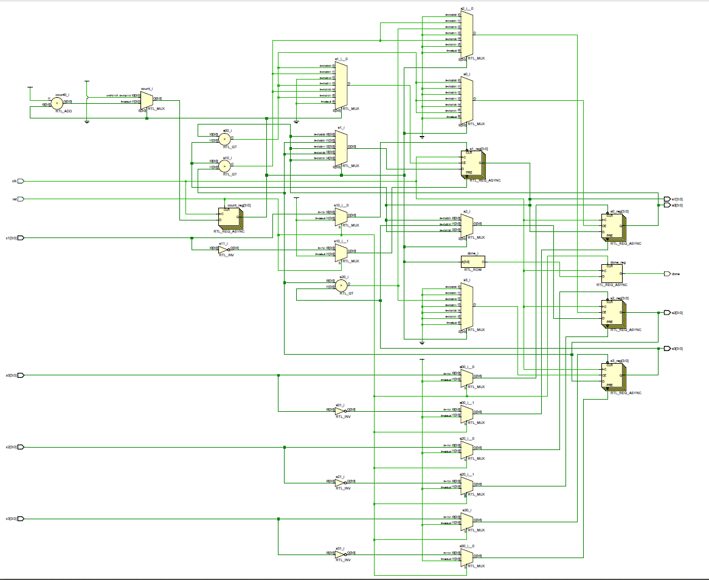
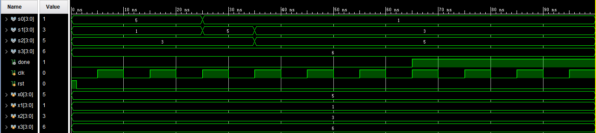
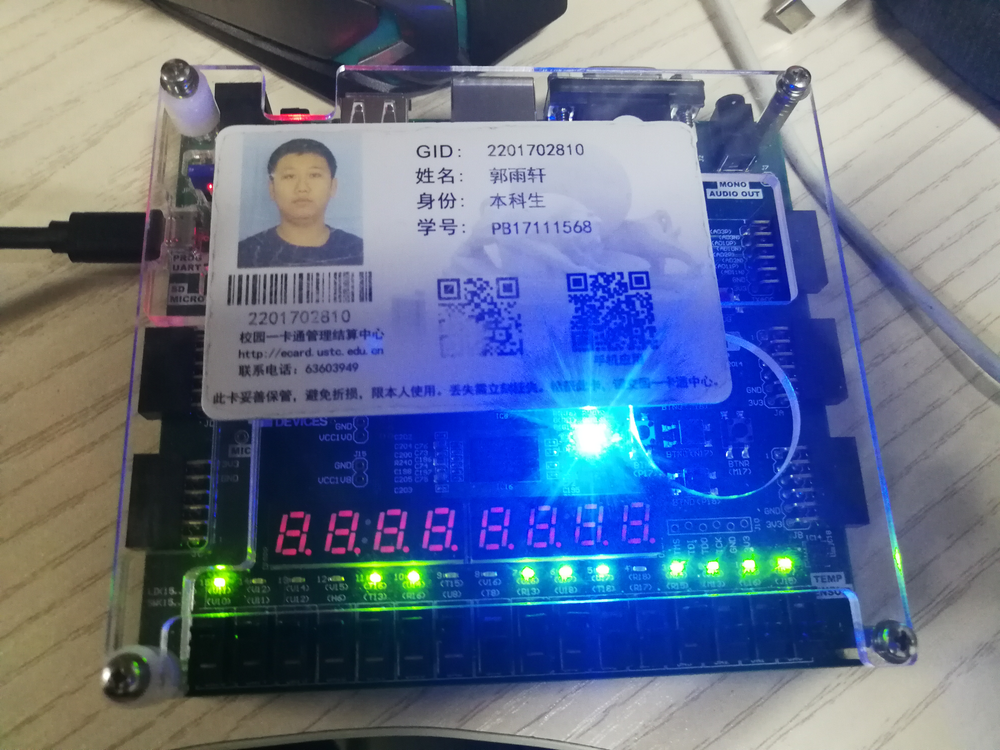
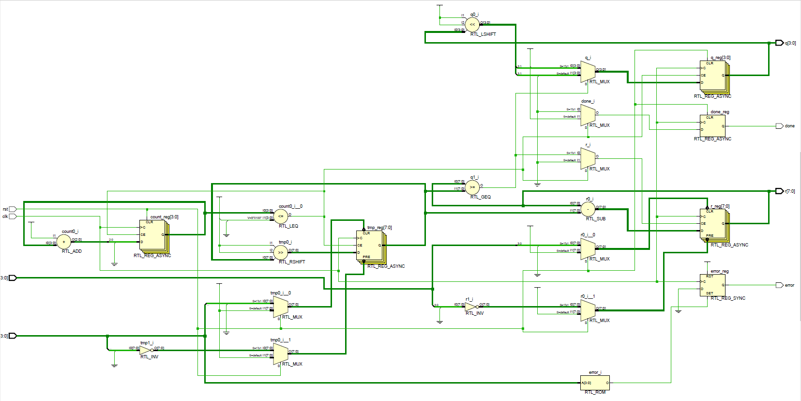
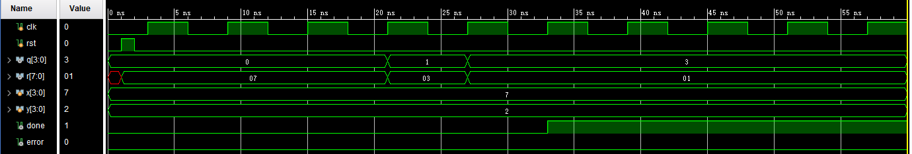
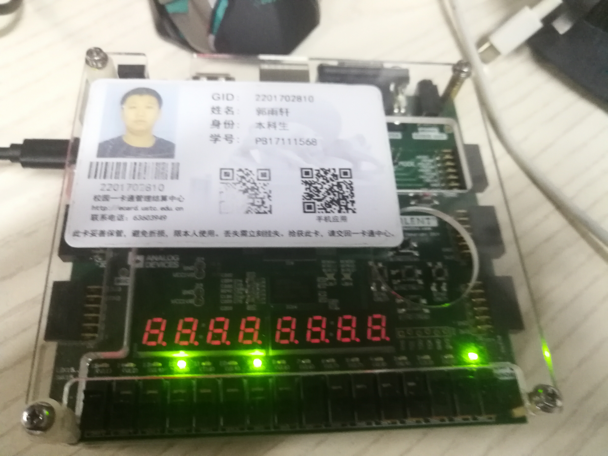

# Lab2_PB17111568_郭雨轩

## Lab1_1

### 设计思路

- 根据题目要求，实现对4个4位数字的冒泡排序只需要进行`3 + 2 + 1 = 6` 次比较，所以在实现时仅需要6个状态就可以完成所有的设计
- 在我的设计当中，每当时钟沿到来的时候，比较一个相邻的两个数字的大小，若不满足大小要求就交换，在完成总共六次比较之后，将done位置为1，结束排序。



### 实验代码

实验代码如下：

``` verilog
module CU #(parameter WIDTH=4)(
    input [WIDTH-1:0]x0,x1,x2,x3,
    input rst,clk,
    output reg [WIDTH-1:0]s0,s1,s2,s3,
    output reg done
    );
    reg [WIDTH-1:0]count,tmp;
    
    always @ (posedge clk or posedge rst)
    begin
        if (rst)
            done=0;
        else
        begin
            if (count == 6)
                done=1;
            else
                done=0;
        end
    end
    
    always @ (posedge clk or posedge rst)
    begin
        if (rst)
            count=0;
        else 
        begin
            if (count ==6)
                count=count;
            else 
                count=count+1;
        end
    end
    
    always @ (posedge clk or posedge rst)
    begin
        if (rst)
        begin
            s0=x0;
            s1=x1;
            s2=x2;
            s3=x3;
        end
        else 
        begin
            case(count)
                4'd0:
                begin
                    if (s0>s1)
                    begin
                        tmp=s0;
                        s0=s1;
                        s1=tmp;
                    end
                end
                4'd1:
                begin
                    if (s1>s2)
                    begin
                        tmp=s1;
                        s1=s2;
                        s2=tmp;
                    end
                end
                4'd2:
                begin
                    if (s2>s3)
                    begin
                        tmp=s2;
                        s2=s3;
                        s3=tmp;
                    end
                end
                4'd3:
                begin
                    if (s0>s1)
                    begin
                        tmp=s0;
                        s0=s1;
                        s1=tmp;
                    end
                end
                4'd4:
                begin
                    if (s1>s2)
                    begin
                        tmp=s1;
                        s1=s2;
                        s2=tmp;
                    end
                end
                4'd5:
                begin
                    if (s0>s1)
                    begin
                        tmp=s0;
                        s0=s1;
                        s1=tmp;
                    end
                end
                default:
                begin
                    s0=s0;
                    s1=s1;
                    s2=s2;
                    s3=s3;
                end
            endcase
        end
    end
endmodule
```

实验所用的testbench代码如下：

``` verilog
module CU_tb(

    );
    
    wire [3:0]s0,s1,s2,s3;
    wire done;
    reg clk,rst;
    reg [3:0]x0,x1,x2,x3;
    CU U (x0,x1,x2,x3,rst,clk,s0,s1,s2,s3,done);
    initial clk=0;
    always #5 clk=~clk;
    initial 
    begin
        rst=1;#1;
        rst=0;
    end
    initial 
    begin
        x0=4'd5;
        x1=4'd1;
        x2=4'd3;
        x3=4'd6;
    end
endmodule
```

### 仿真和下载截图

仿真截图如下，可以看到排序非常稳定：



下载截图如下，排序结束后，蓝色LED亮起：



### 结果分析

在进行排序的时候，每一步都可以显示到对应的灯上，相应的对应着每一个状态。若是需要加快排序的速度，可以将状态机的状态由每一次比较变成每进行一次冒泡，这样，状态数为4.

## Lab2_2

### 设计思路

- 除法器的设计思路主要是使用减法来代替除法，实现4位数的除法，其中涉及到的寄存器变量一共有3个，分别为除数，余数，被除数。这三个寄存器的位数分别为8位、8位、4位。
- 具体实现流程如下：在初始化时，余数寄存器中存放的是被除数的值，每一步迭代计算的时候，都是使用余数寄存器的值减去除数的值。若够减则将`余数-除数`放到余数寄存器中，同时商左移一位，最低位置为1；否则不对余数寄存器中的值进行改动，同时将商左移一位，最低位置0。最后将余数寄存器右移一位，如此迭代`4+1=5` 次，完成除法计算。
- 那么，为什么要采用8位的寄存器来存放除数和余数呢？首先，为了实现除法，我们需要使用被除数减去除数，每次要从被除数中减去尽可能大的除数，那么就需要先将除数尽可能左移，直到左移至减不了为止。上述的描述其实是不定量的，是抽象的，在具体实现过程中不容易实现。
- 我采用的方法是在除法操作进行开始的时候，将4位除数放到了8位除数寄存器的高4位，这样就保证了每次进行减法判断的时候能减去尽可能大的值，通过将除数在每次计算后右移一位来实现每次进行减法减去尽可能大的除数值。
- 那么，余数使用8位的原因就是为了与除数8位的宽度对齐，以保证可以正确的判断大小关系。
- 这中方法仍然存在着空间浪费的情况，可以见到，对于4位数的除法，有8bit的存储空间是不存储信息的（余数4位，除数4位），那么如何进行改进呢，我们可以把除数寄存器改为4位，但是余数寄存器还是8位，在进行计算的时候，将余数寄存器的低4位设置成商，高四位设置成被除数，这样就可以减少硬件资源的使用。



### 实验代码

源代码：

``` verilog
module DIV #(parameter WIDTH = 4)(
    input [WIDTH-1:0]x,y,
    input rst,clk,
    output reg [2*WIDTH-1:0]r,//yushu
    output reg [WIDTH-1:0]q,//shang
    output reg error,done
    );
    reg [2*WIDTH-1:0]tmp;
    //wire [2*WIDTH-1:0]sub_result,rshift_result;
    //wire [WIDTH-1:0]lshift_result;
    //wire [2:0]f0,f1,f2;
    //localparam SUB = 3'd1;
    //localparam RSHIFT = 3'd7;
    //localparam LSHIFT = 3'd6;
    //ALU #(.WIDTH(2*WIDTH)) U1 (r,tmp,SUB,sub_result,f0);
    //ALU #(.WIDTH(2*WIDTH)) U2 (tmp,0,RSHIFT,rshift_result,f1);
    //ALU #(.WIDTH(WIDTH)) U3 (q,0,LSHIFT,lshift_result,f2);
    
    reg [WIDTH-1:0]count;
    initial
    begin
        count = 3'd0;
        q=0;
        tmp[2*WIDTH-1:WIDTH]=y;
        tmp[WIDTH-1:0]=0;
        r=x;
        done=0;
        error=0;
    end
    always @ (posedge clk)
    begin
        if (y==0)
            error=1;
        else 
            error=0;
    end
    
    always @ (posedge clk or posedge rst)
    begin
        if (rst)
        begin
            count = 3'd0;
            q=0;
            tmp[2*WIDTH-1:WIDTH]=y;
            tmp[WIDTH-1:0]=0;
            r=x;
            done=0;
        end
        else
        begin
            if (count<=WIDTH)
            begin
                if (r>=tmp)
                begin
                    r=r-tmp;
                    q=q<<1;
                    q[0]=1'b1;
                end
                else
                begin
                    q=q<<1;
                    q[0]=1'b0;
                end
                count=count+1;
                done=0;
                tmp=tmp>>1;
            end
            else
            begin
                done=1;
            end
        end
    end
endmodule
```

testbench：

``` verilog
module DIV_tb(

    );
    reg clk,rst;
    initial clk=0;
    initial
    begin
        rst=0;#1;
        rst=1;#1;
        rst=0;
    end
    always #3clk=~clk;
    wire [3:0]q;
    wire [7:0]r;
    reg [3:0]x,y;
    wire done,error;
    DIV #(.WIDTH(4)) U (x,y,rst,clk,r,q,error,done); 
    initial 
    begin
        x=4'd7;
        y=4'd2;
    end
endmodule
```

### 仿真与下载截图

仿真：



下载：



### 结果分析

每当时钟沿到来的时候，就进行设计思路部分的逻辑内容，同时将状态计数count＋1，经理过5个周期后，输出正确的值。

## 实验总结

本次实验复习了状态机的内容，我对状态机的硬件描述更加清晰了。此外，由于之前对除法的底层实现不是很清楚，在进行过这次实验后，我对除法的实现更加了解了。同时，对于实验2的两个实验，在做完后我又分别思考了两个提高效率和节省硬件资源的实现方式，收获很大。