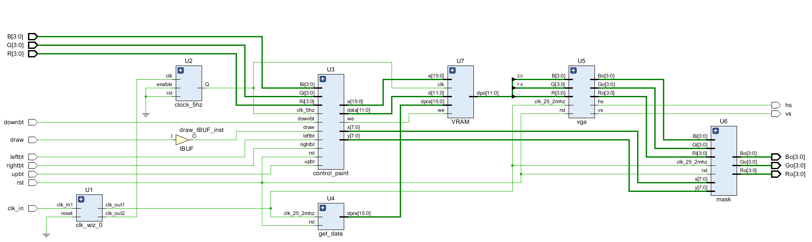
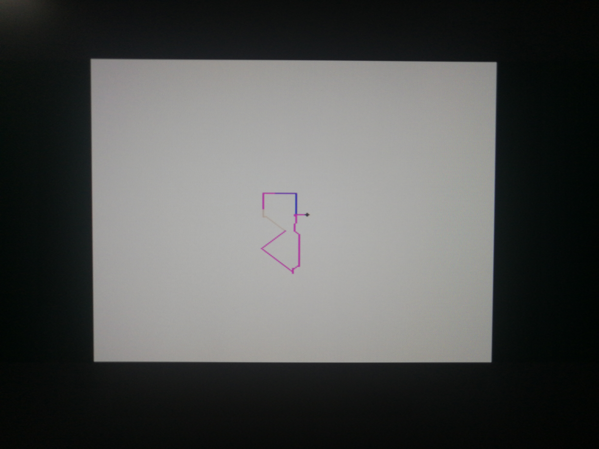

# Lab4_PB17111568_郭雨轩

## 画笔

### 设计思路

在详细说明设计思路之前，首先我给出本次实验的原理图：



从上面的原理图可以看到本次实验的主要模块分为4个，分别为`control_paint`、 `get_data`、 `VGA` 和 `mask` 下面我将依次介绍整体的设计思路和模块的设计思路。

----

#### 整体设计思路

-   首先需要把整个程序的功能分为两个部分，一个是画笔的控制部分，这部分需要向VRAM中写入数据，另一部分是由`get_data` `VGA` `mask` 组成的显示部分。
-   在整个程序运行的时候，显示部分用到25.2Mhz的时钟，`get_addr`按照一定的时序关系读取VRAM中的数据，`VGA`进行显示而`mask`负责将VGA的输出信号中与当前画笔附近的位置画上十字。

----

#### 模块设计思路

-   VGA：
    -   VGA模块设计起来比较简单，首先需要了解的是VGA外设的接口时序，在阅读老师给出的指导后，我了解了时VGA的时序，首先送入每一行的数据，在每一行数据送入结束后，等待显示后沿的时间，给出行同步信号。如此依次扫描每一行，在所有的行扫描结束的时候，再等待场同步后沿的时间，给出场同步信号，如此一帧图像便算是显示结束了。
    -   由于我们要显示的区域是256x256的，而我实际采用的分辨率是640x480的，所以需要在一些没有显示数据的地方直接给黑色，在有显示需要的地方给`get_addr`送入的数据。
    -   那么如何控制所有的信号送入呢，我实现了一个计数器，这个计数器通过时钟上升沿控制，分别是行计数器和列计数器，行同步信号和场同步信号只要根据计数器的值来判定是否要显示就可以了。
-   mask：
    -   mask模块的实现是纯组合逻辑的，他接受当前的画笔坐标，将其转换为VGA中count中的坐标，同时为了保持一致，在在mask内部也实现了跟VGA中相同的计数器，来保证信号的同步。当每个像素经过mask的时候，若其位当前画笔的上下左右的位置时，将其改为纯黑色，以此来实现十字。
-   get_data：
    -   get_data 的输出连向VRAM的异步读端口，同样的，为了保证信号的同步，在get_data中也实现了跟VGA和mask中一样的计数器，只有需要读取数据的时候才会读出对应像素的数据。
-   control_paint：
    -   control_paint中通入的是5hz的时钟，这样保证每秒钟可以画5个像素点，这个module获取当前上下左右的哥按钮的电平，并使用纯组合逻辑将其赋值给8个方位的信号，每当时钟上升沿到来的时候，按照不同方向移动信号的使能，控制画笔向对应防线的移动。
    -   在画笔进行移动的时候，同时向VRAM模块中的对应地址写入相应的颜色信息，同时将写入使能置为1

----

#### 一些设计理念

在本实验中完全可以将VGA、mask、get_data中的三个完全一样的计数器单独拿出来作为一个module，并把上述的三个模块的输入改为计数器的值。如此做就把这3个模块全都变成了组合模块，但是，处于VGA模块复用性的考量，没有如此做。

### 实验代码

1.  VGA

    ``` verilog
    module vga(
        input clk_25_2mhz,rst,
        input [3:0]R,G,B,
        output reg [3:0]Ro,Go,Bo,
        output reg hs,vs
        );
        
        parameter LINE1=200;
            parameter LINE2=456;
            parameter LINE3=640;
            parameter LINE4=656;
            parameter LINE5=752;
            parameter LINE6=800;
              
            parameter ROW1=100;
            parameter ROW2=356;
            parameter ROW3=480;
            parameter ROW4=490;
            parameter ROW5=492;
            parameter ROW6=525;
       
        reg [15:0]line,row;
        
        
        always @ (posedge clk_25_2mhz)
        begin
            if (row<ROW1-1)
            begin
                Ro<=0;
                Go<=0;
                Bo<=0;
            end
            else 
            begin
                if (row>=ROW1-1 && row<ROW2-1)
                begin
                    if (line<LINE1-1)
                    begin
                        Ro<=0;
                        Go<=0;
                        Bo<=0;
                    end
                    else if (line>=LINE1-1 && line<LINE2-1)
                    begin
                        Ro<=R;
                        Go<=G;
                        Bo<=B;
                    end
                    else 
                    begin
                        Ro<=0;
                        Go<=0;
                        Bo<=0;
                    end
                end
                else 
                begin
                    Ro<=0;
                    Go<=0;
                    Bo<=0;
                end
            end
        end
        
        always @ (posedge clk_25_2mhz or posedge rst)
        begin
            if (rst)
            begin
                hs<=0;
            end
            else 
            begin
                if (line<LINE4-1)
                    hs<=0;
                else if (line>=LINE4-1 && line<LINE5-1)
                    hs<=1;
                else
                    hs<=0;
            end
        end
        
        always @ (posedge clk_25_2mhz or posedge rst)
        begin
            if (rst)
                vs<=0;
            else 
            begin
                if (row<ROW4-1)
                    vs<=0;
                else if (row>=ROW4-1 && row<ROW5-1)
                    vs<=1;
                else 
                    vs<=0;
            end
        end
        
        
        always @ (posedge clk_25_2mhz or posedge rst)
        begin
            if (rst)
            begin
                line<=0;
                row<=0;
            end
            else
            begin
                if (line<LINE6-1)
                begin
                    line<=line+1;
                    row<=row;
                end
                else if(line==LINE6-1 && row!=ROW6-1)
                begin
                    line<=0;
                    row<=row+1;
                end 
                else if(line==LINE6-1 && row==ROW6-1)
                begin
                    line<=0;
                    row<=0;
                end 
            end
        end
        
    endmodule
    ```

    

2.  mask

    ``` verilog
    module mask(
        input clk_25_2mhz,rst,
        input [3:0]Ri,Gi,Bi,
        input [7:0]x,y,
        output [3:0]Ro,Go,Bo
        );
        reg [15:0]line,row;
        
        wire is_arrow_x,is_arrow_y,is_arrow;
        wire is_arrow_u_x,is_arrow_u_y,is_arrow_u;
        wire is_arrow_d_x,is_arrow_d_y,is_arrow_d;
        wire is_arrow_l_x,is_arrow_l_y,is_arrow_l;
        wire is_arrow_r_x,is_arrow_r_y,is_arrow_r;
        wire is_mask;
        
        
        
        parameter LINE1=200;
        parameter LINE2=456;
        parameter LINE3=640;
        parameter LINE4=656;
        parameter LINE5=752;
        parameter LINE6=800;
          
        parameter ROW1=100;
        parameter ROW2=356;
        parameter ROW3=480;
        parameter ROW4=490;
        parameter ROW5=492;
        parameter ROW6=525;
        
        ///
        assign is_arrow_x = ((line>=LINE1-1) && (line<LINE2-1) && (line-LINE1-1 == x)) ? 1:0; 
        assign is_arrow_y = ((row>=ROW1-1) && (row<ROW2-1) && (row-ROW1+1 == y)) ? 1:0;
        assign is_arrow = is_arrow_x & is_arrow_y;
        ///
        
        ///
        assign is_arrow_u_x = ((line>=LINE1-1) && (line<LINE2-1) && (line-LINE1-1 == x)) ? 1:0; 
        assign is_arrow_u_y = ((row>=ROW1) && (row<ROW2-1) && (row-ROW1+1 == y-1)) ? 1:0;
        assign is_arrow_u = is_arrow_u_x & is_arrow_u_y;
        ///
        
        ///
        assign is_arrow_d_x = ((line>=LINE1-1) && (line<LINE2-1) && (line-LINE1-1 == x)) ? 1:0; 
        assign is_arrow_d_y = ((row>=ROW1-1) && (row<ROW2-2) && (row-ROW1+1 == y+1)) ? 1:0;
        assign is_arrow_d = is_arrow_d_x & is_arrow_d_y;
        ///
        
        ///
        assign is_arrow_l_x = ((line>=LINE1) && (line<LINE2-1) && (line-LINE1-1 == x-1)) ? 1:0; 
        assign is_arrow_l_y = ((row>=ROW1-1) && (row<ROW2-1) && (row-ROW1+1 == y)) ? 1:0;
        assign is_arrow_l = is_arrow_l_x & is_arrow_l_y;
        ///
        
        ///
        assign is_arrow_r_x = ((line>=LINE1-1) && (line<LINE2-2) && (line-LINE1-1 == x+1)) ? 1:0; 
        assign is_arrow_r_y = ((row>=ROW1-1) && (row<ROW2-1) && (row-ROW1+1 == y)) ? 1:0;
        assign is_arrow_r = is_arrow_r_x & is_arrow_r_y;
        ///
        
        assign is_mask = is_arrow | is_arrow_u | is_arrow_d | is_arrow_r | is_arrow_l;
        
        ///
        assign Ro = is_mask ? 4'b0000 : Ri;
        assign Go = is_mask ? 4'b0000 : Gi;
        assign Bo = is_mask ? 4'b0000 : Bi;
        ///
        
        always @ (posedge clk_25_2mhz or posedge rst)
        begin
            if (rst)
            begin
                line<=0;//1040-1
                row<=0;//666-1
            end
            else
            begin
                if (line<LINE6-1)
                begin
                    line<=line+1;
                    row<=row;
                end
                else if(line==LINE6-1 && row!=ROW6-1)
                begin
                    line<=0;
                    row<=row+1;
                end 
                else if(line==LINE6-1 && row==ROW6-1)
                begin
                    line<=0;
                    row<=0;
                end 
            end
        end
    endmodule
    ```

    

3.  get_data

    ``` verilog
    module get_data(
        input clk_25_2mhz,rst,
        output reg [15:0]dpra
        );
        parameter LINE1=200;
            parameter LINE2=456;
            parameter LINE3=640;
            parameter LINE4=656;
            parameter LINE5=752;
            parameter LINE6=800;
              
            parameter ROW1=100;
            parameter ROW2=356;
            parameter ROW3=480;
            parameter ROW4=490;
            parameter ROW5=492;
            parameter ROW6=525;
        
        reg [15:0]line,row;
        
        always @ (posedge clk_25_2mhz or posedge rst)
        begin
            if (rst)
            begin
                line<=0;//1040-1
                row<=0;//666-1
            end
            else
            begin
                if (line<LINE6-1)
                begin
                    line<=line+1;
                    row<=row;
                end
                else if(line==LINE6-1 && row!=ROW6-1)
                begin
                    line<=0;
                    row<=row+1;
                end 
                else if(line==LINE6-1 && row==ROW6-1)
                begin
                    line<=0;
                    row<=0;
                end 
            end
        end
        
        always @ (posedge clk_25_2mhz or posedge rst)
        begin
            if (rst)
                dpra<=0;
            else
            begin
                if (row<ROW1-1)
                begin
                    dpra<=0;
                end
                else if (row>=ROW1-1 && row<ROW2-1)
                begin
                    if (line<LINE1-1)
                    begin
                        dpra<=0;
                    end
                    else if (line>=LINE1-1 && line<LINE2-1)
                    begin
                        dpra<=(line-LINE1+1)+(row-ROW1+1)*256;
                    end
                    else 
                    begin
                        dpra<=0;
                    end
                end
                else 
                begin
                    dpra<=0;
                end
            end
        end
        
    endmodule
    ```

    

4.  control_paint

    ``` verilog
    module control_paint(
        input upbt,downbt,leftbt,rightbt,clk_5hz,rst,draw,
        input [3:0]Ri,Gi,Bi,
        output [15:0]a,
        output reg [11:0]data,
        output reg [7:0]x,y,
        output we
        
        );
        parameter RESET_X=128;
        parameter RESET_Y=128;
        
        
        wire u,d,l,r,ul,ur,dl,dr;
        
        assign a=x+256*y;
        
        assign u = upbt & ~downbt & ~leftbt & ~rightbt;
        assign d = ~upbt & downbt & ~leftbt & ~rightbt;
        assign l = ~upbt & ~downbt & leftbt & ~rightbt;
        assign r = ~upbt & ~downbt & ~leftbt & rightbt;
        assign ul = upbt & ~downbt & leftbt & ~rightbt;
        assign ur = upbt & ~downbt & ~leftbt & rightbt;
        assign dl = ~upbt & downbt & leftbt & ~rightbt;
        assign dr = ~upbt & downbt & ~leftbt & rightbt;
        
        assign we=draw;
        
        always @ (posedge rst or posedge clk_5hz)
        begin
            if (rst)
            begin
                x<=RESET_X;
                y<=RESET_Y;
            end
            else
            begin
                if (u)
                begin
                    x<=x;
                    y<= (y>0) ? (y-1) : y;
                end
                else if (d)
                begin
                    x<=x;
                    y<= (y<255) ? (y+1) : y;
                end
                else if (l)
                begin
                    y<=y;
                    x<= (x>0) ? (x-1) : x;
                end
                else if (r)
                begin
                    y<=y;
                    x<= (x<255) ? (x+1) : x;
                end
                else if (ul)
                begin
                    x<= (x>0) ? (x-1) : x;
                    y<= (y>0) ? (y-1) : y; 
                end
                else if (ur)
                begin
                    x<= (x<255) ? (x+1) : x;
                    y<= (y>0) ? (y-1) : y;
                end
                else if (dl)
                begin
                    x<= (x>0) ? (x-1) : x;
                    y<= (y<255) ? (y+1) : y;
                end
                else if (dr)
                begin
                    x<= (x<255) ? (x+1) : x;
                    y<= (y<255) ? (y+1) : y;
                end
                else 
                begin
                    x<=x;
                    y<=y;
                end
            end
        end
        
        always @ (posedge clk_5hz)
        begin
            if (draw)
            begin
                data<={Ri,Gi,Bi};
            end
            else 
            begin
                data<=12'hfff;
            end
        end
        
    endmodule
    
    ```

    

5.  TOP

    ``` verilog
    module TOP(
        input upbt,downbt,leftbt,rightbt,clk_in,rst,draw,
        input [3:0]R,G,B,
        output [3:0]Ro,Go,Bo,
        output hs,vs
        );
        wire clk_25_2mhz,clk_5mhz,clk_5hz,locked;
        wire [15:0]a,dpra;
        wire [11:0]d,dpo;
        wire we;
        wire [3:0]Ri,Gi,Bi;
        wire [3:0]Rt,Gt,Bt;
        wire [7:0]x,y;
        
        assign {Ri,Gi,Bi}=dpo;
        
        clk_wiz_0 U1(clk_25_2mhz,clk_5mhz,0,locked,clk_in);
        clock_5hz U2 (clk_5mhz,0,0,clk_5hz);
        control_paint U3 (upbt,downbt,leftbt,rightbt,clk_5hz,rst,draw,R,G,B,a,d,x,y,we);
        get_data U4 (clk_25_2mhz,rst,dpra);
        
        vga U5 (clk_25_2mhz,rst,Ri,Gi,Bi,Rt,Gt,Bt,hs,vs);
        
        mask U6 (clk_25_2mhz,rst,Rt,Gt,Bt,x,y,Ro,Go,Bo);
        
        VRAM U7 (
            .a(a),            // input wire [15 : 0] a
            .d(d),            // input wire [11 : 0] d
            .dpra(dpra),      // input wire [15 : 0] dpra
            .clk(clk_5hz),  // input wire clk
            .we(we),          // input wire we
            .dpo(dpo)        // output wire [11 : 0] dpo
        );
    endmodule
    ```

### 下载截图



### 结果分析

下载运行时一切正常，按下指定的方向键也会向指定方向移动。

### 实验收获

本次实验尝试了自己从未尝试的VGA，我发现读懂了一个外设的时序要求之后，使用这个外设只是需要按照对应的时序生成信号就可以了，做出来还是非常有成就感的。