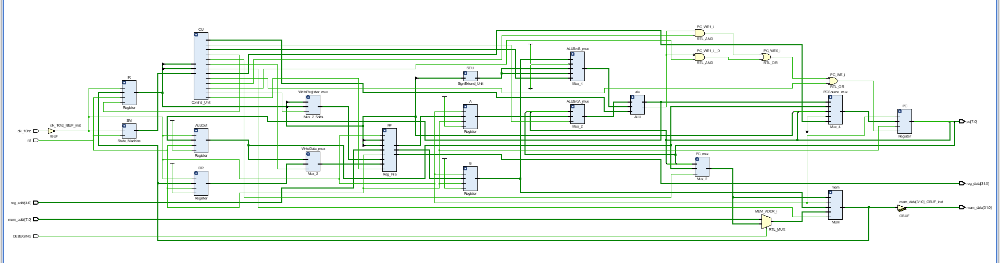
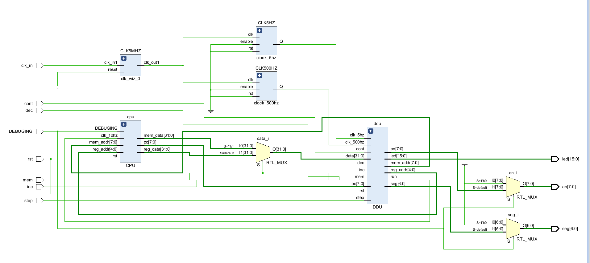

# Lab5_PB17111568_郭雨轩

## 多周期CPU

### 设计思路

首先附上整个CPU的原理图和整个实验的原理图：

1.  CPU原理图：

    

2.  总体设计图：

    

---

#### CPU部分

-   其中，CPU部分直接按照COD书上给出的电路图设计。在这里，由于实例化的dist_mem只能一次读出32位，所以我对相应的寻址当时进行了微小的改动。在执行bne，beq和j指令的时候，将左移两位的组合部分去掉，就可以完美兼容这种情况了。同时，为了设计的简便，我把ALU控制信号的多级译码生成的信号改为全部在控制模块中生成。在设计中，我对一些经常要用到的模块进行了封装，诸如数据选择器和寄存器，按照书上给出的多周期的组织方式进行了连接，得到了CPU的电路图。
-   在CPU的设计中，由于我们的实验要求只在书上给出的已有数据通路中加入了一些I-type指令和bne指令，总的来说改动不大，仅在控制模块中有一些微小的改动。
-   整个CPU中设计难度最大的部分是控制模块，在我设计的CPU中，共生成18个bits的控制量。通过实现一个状态机，在不同的状态下生成对应的控制信号，来保证cpu的正常运行。控制模块的实现也是基本按照书上已有的模型进行控制。但是同时也有一些微小的区别，因为书上给出的数据通路中不包含bne指令的实现，因此在我们设计的cpu中，仿照beq的数据通路，我通过控制模块额外生成一个信号，来标志这是否是bne指令，再将这个信号与ALU_zero取反之后与一下，然后和beq的控制信号或以下，即可实现bne指令。此外对于诸如addi，ori这类指令，只要使用正确的在执行阶段设置ALUSrcB为2即可实现立即数的算术运算。
-   此外还有一个小细节，为了保证寄存器堆中的$0寄存器的值始终为0，在每次对寄存器进行写入操作之后，都将0号寄存器中的值刷新一次，这样就可以保证了。

---

#### DDU部分

有了可以正确运行的CPU，通过将CPU内一些信号拖出来，使用DDU来查看运行的结果，DDU的设计同样比较直观，但是由于硬件条件的限制，在一些地方只能采取一点妥协，DDU的整体设计如下。

-   使用一个状态机来控制当前希望显示的寄存器号或者内存号，使用mem信号来选择使用哪一个地址，将显示的内存号和寄存器号作为地址输入给CPU部分，并将返回的数据通过数码管译码器之后显示到数码管上。
-   由于寄存器堆是自己设计的，所以在设计的时候可以通过多加一个异步读端口来在不干扰CPU正常运行的情况下查看寄存器中的内容，但是dist_mem就不是那么方便了，若要使在运行的过程中显示内存中的内容，会对取指令环节有干扰。所以我又自己加了一个名为DEBUGING的信号，用来标识是否在进行DEBUG。当这个信号有效的时候，CPU停止工作（通过在顶层模块中将其与时钟信号与即可），可以显示内存中的数据，当其非有效的时候，数码管不输出，CPU可以正常运转。

----

#### TOP部分

-   TOP部分负责将CPU和DDU两部分连接起来，同时通过为了减小DDU的端口数量，使用mem信号作为数据选择器的选择信号，选择是内存中的数据还是寄存器中的数据，这样DDU只需要一个data端口了。
-   同时，为了保证数码管显示的只可能是用户选定的地址的寄存器数据或者内存数据，当DEBUGING信号非有效的时候，数码管不输出。

---

### 实验代码

#### CPU

1.  寄存器堆：

    ``` verilog
    module Reg_File(
        input [4:0]ra0,ra1,ra2,wa,
        input [31:0]wd,
        input we,rst,clk,
        output [31:0]rd0,rd1,rd2
        );
        reg [31:0]rf[31:0];
        always @ (posedge clk or posedge rst)
        begin
            if (rst)
            begin
                rf[0]=0;
                rf[1]=0;
                rf[2]=0;
                rf[3]=0;
                rf[4]=0;
                rf[5]=0;
                rf[6]=0;
                rf[7]=0;
                rf[8]=0;
                rf[9]=0;
                rf[10]=0;
                rf[11]=0;
                rf[12]=0;
                rf[13]=0;
                rf[14]=0;
                rf[15]=0;
                rf[16]=0;
                rf[17]=0;
                rf[18]=0;
                rf[19]=0;
                rf[20]=0;
                rf[21]=0;
                rf[22]=0;
                rf[23]=0;
                rf[24]=0;
                rf[25]=0;
                rf[26]=0;
                rf[27]=0;
                rf[28]=0;
                rf[29]=0;
                rf[30]=0;
                rf[31]=0;
            end
            else
            begin
                if (we)
                begin
                    rf[wa]=wd;
                    rf[0]=0;
                end
            end
        end
        assign rd0=rf[ra0];
        assign rd1=rf[ra1];
        assign rd2=rf[ra2];
    endmodule
    ```

2.  寄存器

    ``` verilog
    module Register #(parameter WIDTH=32)(
        input [WIDTH-1:0]in,
        input clk,rst,we,
        output reg [WIDTH-1:0]out
        );
        
        always @ (posedge clk or posedge rst)
        begin
            if (rst)
                out<=0;
            else
            begin
                if (we)
                    out<=in;
            end        
        end
        
        
    endmodule
    ```

3.  数据选择器（2输入）

    ```verilog
    module Mux_2(
        input [31:0]in0,in1,
        input select,
        output [31:0]out
        );
        assign out = (select == 0) ? in0 : in1;
    endmodule
    ```

4.  数据选择器（4输入）

    ``` verilog
    module Mux_4(
        input [31:0]in0,in1,in2,in3,
        input [1:0]select,
        output reg [31:0]out
        );
        
        always @ (*)
        begin
            case (select)
                2'b00:out=in0;
                2'b01:out=in1;
                2'b10:out=in2;
                2'b11:out=in3;
            endcase
        end
        
    endmodule
    ```

5.  ALU

    ``` verilog
    module ALU(
        input signed [31:0]a,b,
        input signed[3:0]s,
        output reg [31:0]y,
        output zero
        );
        parameter AND=4'b0000;
        parameter OR=4'b0001;
        parameter ADD=4'b0010;
        parameter SUB=4'b0110;
        parameter SLT=4'b0111;
        parameter NOR=4'b1100;
        parameter XOR=4'b1101;
        
        
        always @ (*)
        begin
            case(s)
                ADD:y=a+b;
                SUB:y=a+~b+1;
                AND:y=a&b;
                OR:y=a|b;
                XOR:y=a^b;
                NOR:y=~(a|b);
                SLT:y=(a<b)?1:0;
                default:y=0;
            endcase
        end
        
        assign zero = (y == 0) ? 1:0;
        
    endmodule
    ```

6.  控制模块

    ``` verilog
    module Control_Unit(
        input [5:0]op,
        input [5:0]funct,
        input [2:0]state,
        output PCWriteCond_E,PCWriteCond_NE,PCWrite,IorD,MemWrite,MemToReg,IRWrite,
        output [1:0]PCSource,
        output [3:0]ALUOp,
        output [1:0]ALUSrcB,
        output ALUSrcA,RegWrite,RegDst
        );
        
        parameter I=3'b000;
        parameter II=3'b001;
        parameter III=3'b010;
        parameter IV=3'b011;
        parameter V=3'b100;
        
        parameter AND=4'b0000;
        parameter OR=4'b0001;
        parameter ADD=4'b0010;
        parameter SUB=4'b0110;
        parameter SLT=4'b0111;
        parameter NOR=4'b1100;
        parameter XOR=4'b1101;
        
        parameter ADD_f=6'b100000;
        parameter AND_f=6'b100100;
        parameter NOR_f=6'b100111;
        parameter OR_f=6'b100101;
        parameter SLT_f=6'b101010;
        parameter XOR_f=6'b100110;
        parameter SUB_f=6'b100010;
        
        parameter SW=6'b101011;
        parameter LW=6'b100011;
        parameter Rtype=6'b000000;
        parameter BEQ=6'b000100;
        parameter BNE=6'b000101;
        parameter J=6'b000010;
        parameter ADDI=6'b001000;
        parameter ANDI=6'b001100;
        parameter ORI=6'b001101;
        parameter XORI=6'b001110;
        parameter SLTI=6'b001010;
        parameter Imm=3'b001;
        
        reg  [17:0]signal;
        assign {PCWriteCond_E,PCWriteCond_NE,PCWrite,IorD,MemWrite,MemToReg,IRWrite,ALUSrcA,RegWrite,RegDst,PCSource,ALUOp,ALUSrcB}=signal;
        
        always @ (state)
        begin
            if (state==I)
            begin
                signal=18'b001000100000001001;
            end
            else if (state==II)
            begin
                signal=18'b000000000000001011;
            end
            else if (state==III)
            begin
                if (op == LW || op == SW)
                begin
                    signal=18'b000000010000001010;
                end
                else if (op[5:3]==Imm)//PCWriteCond_E,PCWriteCond_NE,PCWrite,IorD,MemWrite,MemToReg,IRWrite,ALUSrcA,RegWrite,RegDst,PCSource,ALUOp,ALUSrcB
                begin
                    case(op)
                        ADDI:signal=18'b000000010000001010;
                        ANDI:signal=18'b000000010000000010;
                        ORI:signal=18'b000000010000000110;
                        XORI:signal=18'b000000010000110110;
                        SLTI:signal=18'b000000010000011110;
                        default:signal=18'd0;
                    endcase
                end
                else if (op == Rtype)
                begin
                    case(funct)
                        ADD_f:signal=18'b000000010000001000;
                        AND_f:signal=18'b000000010000000000;
                        NOR_f:signal=18'b000000010000110000;
                        OR_f:signal=18'b000000010000000100;
                        SLT_f:signal=18'b000000010000011100;
                        SUB_f:signal=18'b000000010000011000;
                        XOR_f:signal=18'b000000010000110100;
                        default:signal=18'd0;
                    endcase
                end
                else if (op == BEQ)
                begin
                    signal=18'b100000010001011000;
                end
                else if (op == BNE)
                begin
                    signal=18'b010000010001011000;
                end
                else if (op == J)//PCWriteCond_E,PCWriteCond_NE,PCWrite,IorD,MemWrite,MemToReg,IRWrite,ALUSrcA,RegWrite,RegDst,PCSource,ALUOp,ALUSrcB
                begin
                    signal=18'b001000000010001000;
                end
                else 
                begin
                    signal=18'd0;
                end
            end
            else if (state==IV)
            begin
                if (op == LW)
                begin
                    signal=18'b000100000000001000;
                end
                else if (op == SW)
                begin
                    signal=18'b000110000000001000;
                end
                else if (op == Rtype)//PCWriteCond_E,PCWriteCond_NE,PCWrite,IorD,MemWrite,MemToReg,IRWrite,ALUSrcA,RegWrite,RegDst,PCSource,ALUOp,ALUSrcB
                begin
                    signal=18'b000000001100001000;
                end
                else if (op[5:3] ==Imm) 
                begin
                    signal=18'b000000001000001000;
                end
                else 
                begin
                    signal=18'd0;
                end
            end
            else if (state==V)
            begin
                if (op == LW)
                begin
                    signal=18'b000001001000001000;
                end
                else 
                begin
                    signal=18'd0;
                end
            end
            else
            begin
                signal=18'd0;
            end
        end
        
    endmodule
    ```

7.   状态机

    ``` verilog
    module State_Machine(
        input clk,rst,
        output reg [2:0]state
        );
        
        always @ (posedge clk or posedge rst)
        begin
            if (rst)
                state<=3'b000;
            else
            begin
                if(state == 3'b100)
                    state<=3'b000;
                else
                    state<=state+1;
            end
        end
        
    endmodule
    ```

8.  CPU **注：CPU代码中一些注释掉的内容是仿真的时候使用的**

    ``` verilog
    module CPU(
        input clk_10hz,rst,DEBUGING,
        input [4:0]reg_addr,
        input [7:0]mem_addr,
        output [31:0]reg_data,mem_data,
        output [7:0]pc
        //output [31:0]ir,dr,a,b,aluout,
        //output PCWriteCond_E,PCWriteCond_NE,PCWrite,IorD,MemWrite,MemtoReg,IRWrite,ALUSrcA,RegWrite,RegDst,
        //output [1:0] PCSource,ALUSrcB,
        //output [3:0]ALUOp,
        //output [31:0]ext,
        //output [4:0]writeregisteraddr
        );
        wire PCWriteCond_E,PCWriteCond_NE,PCWrite,IorD,MemWrite,MemtoReg,IRWrite;
        wire [1:0]PCSource,ALUSrcB;
        wire [3:0]ALUOp;
        wire ALUSrcA,RegWrite,RegDst;
        
        wire zero,PC_WE;
        wire [31:0]ALU_out,PC_out,MEM_out,IR_out,DR_out;
        wire [31:0]RF1_out,RF2_out,A_out,B_out;
        wire [31:0]ALU_res;
        wire [31:0]PC_mux_out,ALUSrcA_mux_out;
        wire [31:0]Writedata,WriteData_mux_out,SignExtend_out,ALUSrcB_mux_out,PCSource_mux_out;
        wire [4:0]WriteReg_mux_out;
        
        
        wire [4:0]Display_ra;
        wire [31:0]Display_rd;
    
        wire [7:0]MEM_ADDR;
        
        wire [2:0]state;
        
        assign PC_WE=(((zero & PCWriteCond_E) | (~zero & PCWriteCond_NE)) | PCWrite);
        
        /******************************-- display_code --*****************************************/
        assign Display_ra=reg_addr;
        assign reg_data=Display_rd;
        
        assign mem_data=MEM_out;
        
        assign MEM_ADDR = (DEBUGING ==1)? mem_addr:PC_mux_out[7:0];
        assign pc=PC_out[7:0];
        /******************************-- display_code --*****************************************/
        
        
        /******************************-- display_code --*****************************************/
        /*
        assign ir=IR_out;
        assign dr=DR_out;
        assign a=A_out;
        assign b=B_out;
        assign aluout=ALU_out;
        assign ext=SignExtend_out;
        assign writeregisteraddr=WriteReg_mux_out;
        */
        /******************************-- display_code --*****************************************/
        
        Register PC (PCSource_mux_out,clk_10hz,rst,PC_WE,PC_out);
        Register IR (MEM_out,clk_10hz,rst,IRWrite,IR_out);
        Register DR (MEM_out,clk_10hz,rst,1,DR_out);
        Register A (RF1_out,clk_10hz,rst,1,A_out);
        Register B (RF2_out,clk_10hz,rst,1,B_out);
        Register ALUOut (ALU_res,clk_10hz,rst,1,ALU_out);
        
        Mux_2 PC_mux (PC_out,ALU_out,IorD,PC_mux_out);
        Mux_2 ALUSrcA_mux (PC_out,A_out,ALUSrcA,ALUSrcA_mux_out);
        Mux_2 WriteData_mux (ALU_out,DR_out,MemtoReg,WriteData_mux_out);
        Mux_2_5bits WriteRegister_mux (IR_out[20:16],IR_out[15:11],RegDst,WriteReg_mux_out);
        
        Mux_4 ALUSrcB_mux (B_out,1,SignExtend_out,SignExtend_out,ALUSrcB,ALUSrcB_mux_out);
        Mux_4 PCSource_mux (ALU_res,ALU_out,{PC_out[31:26],IR_out[25:0]},0,PCSource,PCSource_mux_out);
        
        State_Machine SM (clk_10hz,rst,state);
        
        Control_Unit CU (IR_out[31:26],IR_out[5:0],state,PCWriteCond_E,PCWriteCond_NE,PCWrite,IorD,MemWrite,MemtoReg,IRWrite,PCSource,ALUOp,ALUSrcB,ALUSrcA,RegWrite,RegDst); 
        
        Reg_File RF (IR_out[25:21],IR_out[20:16],Display_ra,WriteReg_mux_out,WriteData_mux_out,RegWrite,rst,clk_10hz,RF1_out,RF2_out,Display_rd);
        ALU alu (ALUSrcA_mux_out,ALUSrcB_mux_out,ALUOp,ALU_res,zero);
        MEM mem (.a(PC_mux_out[7:0]),.d(B_out),.dpra(MEM_ADDR),.clk(clk_10hz),.we(MemWrite),.dpo(MEM_out));
        SignExtend_Unit SEU (IR_out[15:0],SignExtend_out);
    endmodule
    ```


#### DDU

1.  bcd_decoder

    ``` verilog
    module bcd_decoder(
        input [2:0]count,
        input [3:0]x,
        output reg [6:0]seg,
        output reg [7:0]an
        );
        
        always @ (x)
        begin
            case(x)
                4'b0000:seg <= 7'b1000000;
                4'b0001:seg <= 7'b1111001;
                4'b0010:seg <= 7'b0100100;
                4'b0011:seg <= 7'b0110000;
                4'b0100:seg <= 7'b0011001;
                4'b0101:seg <= 7'b0010010;
                4'b0110:seg <= 7'b0000010;
                4'b0111:seg <= 7'b1111000;
                4'b1000:seg <= 7'b0000000;
                4'b1001:seg <= 7'b0010000;
                4'b1010:seg <= 7'b0001000;
                4'b1011:seg <= 7'b0000011;
                4'b1100:seg <= 7'b1000110;
                4'b1101:seg <= 7'b0100001;
                4'b1110:seg <= 7'b0000110;
                4'b1111:seg <= 7'b0001110;
            endcase
        end
        
        always @ (*)
        begin
            case(count)
                3'b000:an=8'b01111111;
                3'b001:an=8'b10111111;
                3'b010:an=8'b11011111;
                3'b011:an=8'b11101111;
                3'b100:an=8'b11110111;
                3'b101:an=8'b11111011;
                3'b110:an=8'b11111101;
                3'b111:an=8'b11111110;
            endcase
        end
    endmodule
    
    ```

2.  DDU

    ``` verilog
    module DDU(
        input cont,step,mem,inc,dec,clk_500hz,clk_5hz,rst,
        input [7:0]pc,
        input [31:0]data,
        output run,
        output reg [4:0]reg_addr,
        output reg [7:0]mem_addr,
        output [15:0]led,
        output [6:0]seg,
        output [7:0]an
        );
        
        wire [7:0]addr;
        assign run = (cont == 1) ? clk_500hz:step;
        
        assign addr=(mem == 1)? mem_addr:{3'b000,reg_addr};
        
        assign led = {pc,addr};
        reg [2:0]count;
        wire [3:0]display[7:0];
        wire [3:0]d;
        assign display[0]=data[3:0];
        assign display[1]=data[7:4];
        assign display[2]=data[11:8];
        assign display[3]=data[15:12];
        assign display[4]=data[19:16];
        assign display[5]=data[23:20];
        assign display[6]=data[27:24];
        assign display[7]=data[31:28];
        
        bcd_decoder U (count,d,seg,an);
        
        assign d=display[7-count];
        
        initial count=0;
        
        always @ (posedge rst or posedge clk_5hz)
        begin
            if (rst)
                mem_addr<=0;
            else 
            begin
                if (inc && mem)
                begin
                    mem_addr <= (mem_addr<255) ? (mem_addr+1):mem_addr;
                end
                else if (dec && mem)
                begin
                    mem_addr <= (mem_addr>0) ? (mem_addr-1):mem_addr;
                end
            end
        end
        
        always @ (posedge rst or posedge clk_5hz)
        begin
            if (rst)
                reg_addr<=0;
            else 
            begin
                if (inc && ~mem)
                begin
                    reg_addr <= (reg_addr<31) ? (reg_addr+1):reg_addr;
                end
                else if (dec && ~mem)
                begin
                    reg_addr <= (reg_addr>0) ? (reg_addr-1):reg_addr;
                end
            end
        end
       
        always @ (posedge clk_500hz or posedge rst)
        begin
            if (rst)
            begin
                count=0;
            end
            else
            begin
                count=count+1;
            end
            
        end
    endmodule
    ```

#### TOP

```verilog
module TOP(
    input cont,step,mem,inc,dec,clk_in,rst,DEBUGING,
    output [15:0]led,
    output [6:0]seg,
    output [7:0]an
    );
    wire clk_500hz,clk_5hz,clk_5mhz;
    wire locked;
    wire run;
    wire cpu_clock;
    wire [31:0]data;
    
    wire [4:0]reg_addr;
    wire [7:0]mem_addr;
    wire [31:0]reg_data,mem_data;
    
    wire [6:0]seg_o;
    wire [7:0]an_o;
    wire [7:0]pc;
    
    assign data = (mem == 1)? mem_data:reg_data;
    
    
    assign cpu_clock = run;
    assign seg = (DEBUGING == 0)? 7'b1111111:seg_o;
    assign an = (DEBUGING == 0)? 8'b11111111:an_o;
    
    clk_wiz_0 CLK5MHZ (clk_5mhz,0,locked,clk_in);
    clock_500hz CLK500HZ (clk_5mhz,0,0,clk_500hz);
    clock_5hz CLK5HZ (clk_5mhz,0,0,clk_5hz);
    CPU cpu (cpu_clock,rst,DEBUGING,reg_addr,mem_addr,reg_data,mem_data,pc);
    DDU ddu (cont,step,mem,inc,dec,clk_500hz,clk_5hz,rst,pc,data,run,reg_addr,mem_addr,led,seg_o,an_o);
endmodule
```

### 实验截图

1.  仿真截图

    

2.  下载截图

    

### 结果分析

通过对提供的代码进行一行一行的验证，每一步运行结果都正确，不多赘述。

### 实验收获

-   在书上给出的CPU数据通路的基础上自己再稍加进行改动，实现了多周期CPU，加深了对CPU的理解。
-   加深了对mips汇编的理解
-   实验用时一天，很有成就感（雾