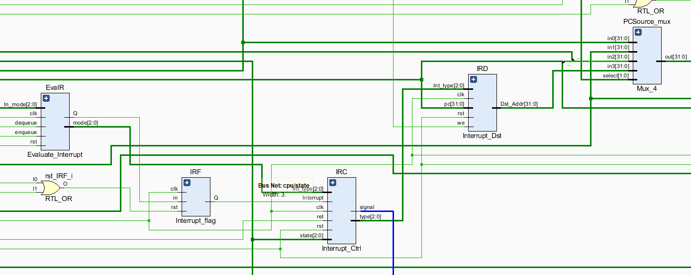
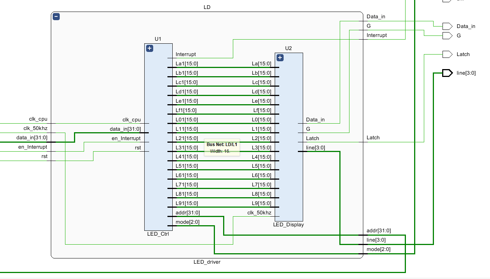
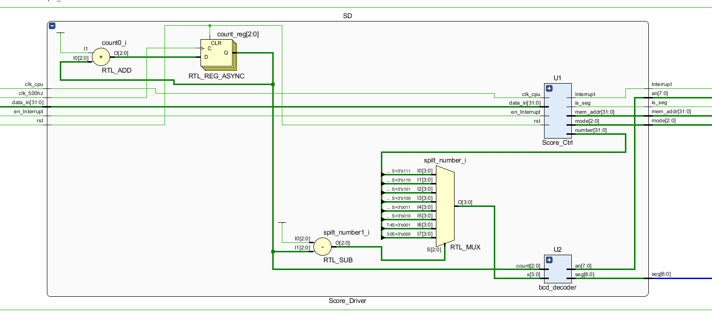
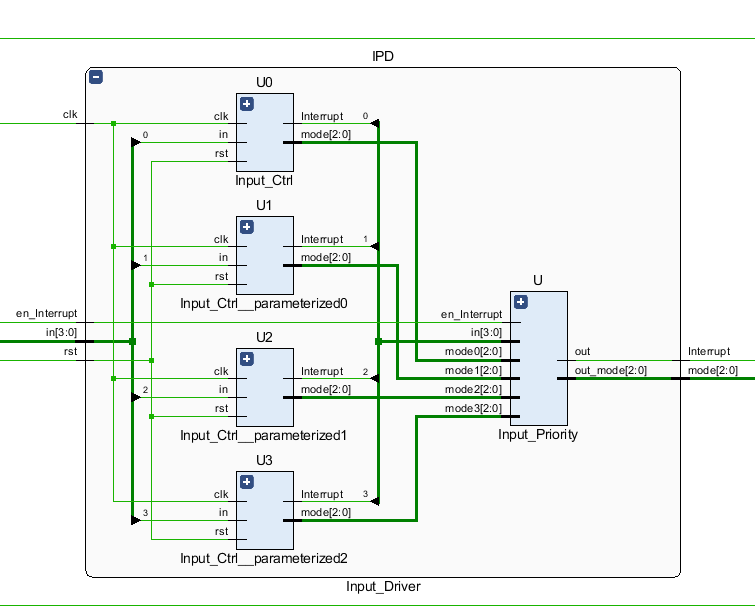
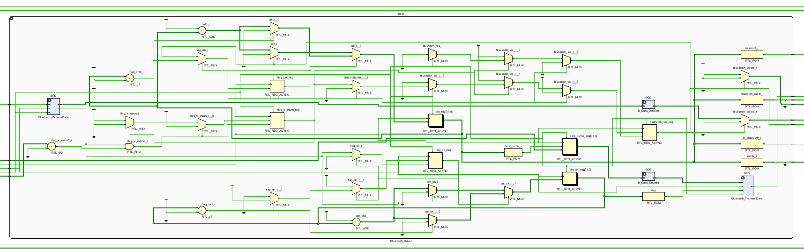
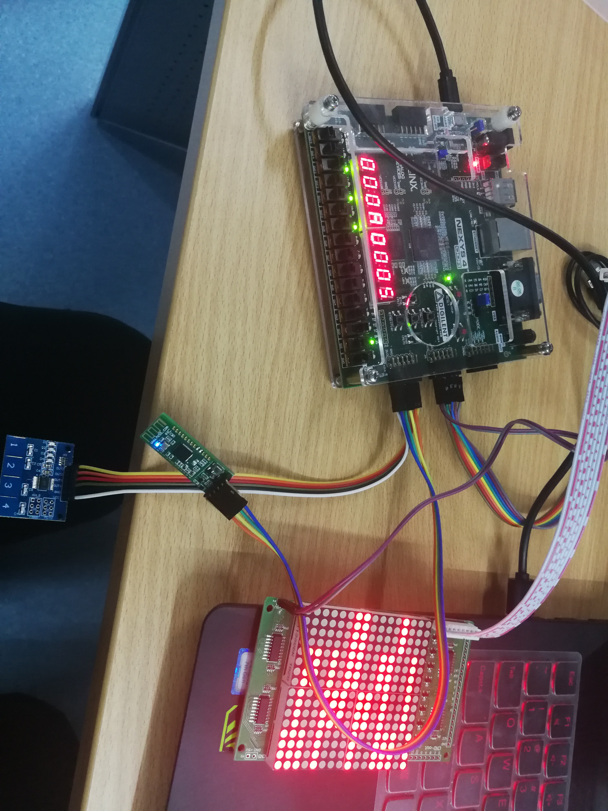

# Lab6_PB17111568_郭雨轩

## 综合设计

### 实验内容介绍

本次实验中，我以lab5中实现的多周期CPU为基础，在CPU改进方面我增加了一套对单层中断的支持，同时通过循环队列将未处理的中断存储起来，按照FCFS的顺序执行中断；在外设使用方面我使用了数码管、LED点阵、触控开关和蓝牙芯片HC-42这四个外设，使用内存映射的方式实现它们与CPU交换数据，使用中断来驱动这4个外设。维持数码管数据的刷新和LED点阵内容的刷新是使用定时中断的方式实现的，而蓝牙和触控键盘是使用的异步中断。

### 硬件部分设计思路及代码

在这个部分我将主要介绍几个比较关键的功能的设计思路。

#### 1. 中断设计

-   让CPU实现中断的功能是我最开始想到的一个对CPU的改进。首先是中断数据通路的设计，为了尽量小的对数据通路进行改动，再联想到之前的多周期CPU中PCSource多选器仅仅使用了3个端口，于是可以将中断要跳向的目标地址和中断返回的pc地址送入到其第四个端口，电路图如下：

    其中IRD模块负责接受向pcsource提供正确的地址，当从中断返回的时候，提供的是原来储存的pc值，否则则根据中断号来向pcsource送去相应的地址。

-   如何设计中断呢，主要方法如下，在control_unit中，每当执行到最后一个状态的时候，若中断信号有效，则跳向一个新的状态，在这个状态中，将当前pc的值写入到IRD中的寄存器内，同时IRD提供跳向的目标pc，通过4路数据选择器将新的pc值送入pc寄存器中，完成中断跳转。返回时，使用ERET指令进行返回，将原有的PC值送入到pc寄存器中，同时将Interrupt_flag重置，在新的时钟沿到来的时候，再从EvalR队列中读取下一个要处理的中断，若没有则返回到正常的运行中去。

-   在中断的实现过程中，还要注意这些细节：外部I/O若想调用中断，应该生成怎样的信号呢？在我的实现中，只需要外部设备给一个cpu时钟周期的中断信号使能和一个时钟周期的中断号即可，cpu会将这一个时钟周期的信号送入队列并在Interrupt_flag中产生一个一直为高的信号，这个信号被送入到Interrupt_Ctrl中，在这个模块中，为了防止不停的进行中断，再将这个信号转换成只会持续一个时钟周期的信号，当中断返回的时候，只要清空中断flag（异步清空），同时将清空信号接入到队列的出队信号上（同步出队），当时钟沿到来的时候。就会更新中断的状态了。

下面附上这几个模块的代码：

1.  ```verilog
    module Interrupt_Dst(
        input clk,rst,
        input [2:0]Int_type,
        input [31:0]pc,
        input we,
        output reg [31:0]Dst_Addr
        );
        wire [31:0]out;
        parameter Dir1=32'd80;
        parameter Dir2=32'd109;
        parameter Dir3=32'd43;
        parameter Dir4=32'd78;
        parameter Dir5=32'd88;
        parameter Dir6=32'd95;
        parameter Dir7=32'd102;
    
    
        Register R (pc,clk,rst,we,out);
        always @ (*)
        begin
            case(Int_type)
                3'd0:Dst_Addr=out;
                3'd1:Dst_Addr=Dir1;
                3'd2:Dst_Addr=Dir2;
                3'd3:Dst_Addr=Dir3;
                3'd4:Dst_Addr=Dir4;
                3'd5:Dst_Addr=Dir5;
                3'd6:Dst_Addr=Dir6;
                3'd7:Dst_Addr=Dir7;
                default:Dst_Addr=0;
            endcase
        end
    endmodule
    
    ```

2.  ``` verilog
    module Interrupt_Ctrl(
        input clk,rst,Interrupt,
        input [2:0]state,
        input [2:0]Int_type,
        input ret,
        output reg signal,
        output [2:0] type
        );
        
        assign type= (ret==0) ? Int_type:3'b000;
        
        reg flag;
        always @(posedge clk or posedge rst)
        begin
            if (rst)
            begin
                signal=0;
                flag=0;
            end
            else 
            begin
                if (Interrupt)
                begin
                    if (state == 3'b011)
                    begin
                        if (flag==0)
                        begin
                            signal=1;
                            flag=1;
                        end
                        else
                        begin
                            signal=0;
                        end
                    end
                    else 
                    begin
                        signal=0; 
                    end
                end
                else 
                begin
                    signal=0;
                    flag=0;
                end
            end
        end
        
    endmodule
    
    ```

3.  ``` verilog
    module Evaluate_Interrupt(
        input clk,rst,dequeue,enqueue,
        input [2:0]In_mode,
        output Q,
        output [2:0] mode
        );
        
        reg [3:0]count; 
        reg [2:0]I_modes[7:0];  
        wire full,empty;
        reg [2:0]head,dir;
        assign full = (count == 8)? 1:0;
        assign empty = (count ==0)? 1:0;
        assign Q = ~empty;
        assign mode = I_modes[head];
        always @ (posedge clk or posedge rst)
        begin
            if (rst)
            begin
                I_modes[0]=3'b000;
                I_modes[1]=3'b000;
                I_modes[2]=3'b000;
                I_modes[3]=3'b000;
                I_modes[4]=3'b000;
                I_modes[5]=3'b000;
                I_modes[6]=3'b000;
                I_modes[7]=3'b000;
                count=0;
                head=0;
            end
            else 
            begin
                if (dequeue)
                begin
                    if (~empty)
                    begin
                        count =count -1;
                        I_modes[head]=3'b000;
                        head=head+1;
                    end
                end
                else if (enqueue)
                begin
                    if (~full)
                    begin
                        dir=count+head;
                        I_modes[dir]=In_mode;
                        count=count+1;
                    end
                end
            end
        end
    endmodule
    ```

4.  ``` verilog
    module Interrupt_flag(
        input clk,rst,in,
        output reg Q
        );
        
        reg flag;
        
        always @ (posedge clk or posedge rst)
        begin
            if (rst)
            begin
                Q<=0;
                flag<=0;
            end
            else 
            begin
                if (in)
                begin
                    flag<=1;
                    Q<=1;
                end
                else
                begin
                    if (flag==1)
                    begin
                        Q<=1;
                    end
                    else
                    begin
                        Q<=0;
                    end
                end
            end
        end
    endmodule
    
    ```

#### 2. LED点阵外设驱动

-   LED点阵外设有着与VGA类似的驱动时序，基本原理也是进行行列扫描，之所以选择LED点阵作为本次实验的显示外设，是因为LED对于内存的开销较小，同时调试方便。
-   LED_driver模块的主要功能有两个，第一个是生成驱动LED点阵正常显示的时序信号，并将数据正常的送入到对应的输出端口，另一个功能是从外设映射到的内存中读取相应的数据，将数据送入到驱动器中的buffer中，进行数据读取之后，触发一次定时中断，让cpu刷新外设映射到的内存中的数据，换成下一帧要显示的数据。定时中断是如何产生的呢，我是通过对CPU时钟上升沿计数产生的，每计特定的数字，就产生一个中断，同时由于数码管显示分数的刷新也是使用的定时中断，为了避免这两个中断冲突，我采用了在不同周期生成中断信号来解决这个问题。

下面附上代码：

1.  ``` verilog
    module LED_driver(
        input clk_cpu,clk_50khz,rst,en_Interrupt,
        input [31:0]data_in,
        output Interrupt,
        output [2:0]mode,
        output [31:0]addr,
        output [3:0]line,
        output Latch,G,Data_in
        );
        
        wire [15:0]L0,L1,L2,L3,L4,L5,L6,L7,L8,L9,La,Lb,Lc,Ld,Le,Lf;
        LED_Ctrl U1 (clk_cpu,rst,en_Interrupt,data_in,Interrupt,mode,addr,L0,L1,L2,L3,L4,L5,L6,L7,L8,L9,La,Lb,Lc,Ld,Le,Lf);
        LED_Display U2 (L0,L1,L2,L3,L4,L5,L6,L7,L8,L9,La,Lb,Lc,Ld,Le,Lf,clk_50khz,line,Latch,G,Data_in);
    endmodule
    ```

2.  ``` verilog
    module LED_Ctrl #(parameter cycles=4999999)(
        input clk_cpu,rst,en_Interrupt,
        input [31:0]data_in,
        output Interrupt,
        output [2:0]mode,
        output [31:0]addr,
        output reg [15:0]L01,L11,L21,L31,L41,L51,L61,L71,L81,L91,La1,Lb1,Lc1,Ld1,Le1,Lf1
        );
        localparam LED_RefreshCycles = cycles;//clk_cpu == 5Mhz
        localparam LED_IO_In_Mem = 32'd119;///////////////////////////
        localparam LED_IRQ = 3'b011;
        localparam point=20000;
        
        reg [31:0]cnt;
        wire [15:0]data;
        reg [15:0]L0,L1,L2,L3,L4,L5,L6,L7,L8,L9,La,Lb,Lc,Ld,Le,Lf;
        assign data = {data_in[3],data_in[3],data_in[3],data_in[3],data_in[2],data_in[2],data_in[2],data_in[2],data_in[1],data_in[1],data_in[1],data_in[1],data_in[0],data_in[0],data_in[0],data_in[0]};
        
        assign addr = (cnt<=15) ? (LED_IO_In_Mem+cnt):0;
        assign Interrupt = ((cnt==point) && (en_Interrupt)) ? 1:0;
        assign mode = ((cnt==point) && (en_Interrupt)) ? LED_IRQ:3'b000;
        always @ (posedge clk_cpu or posedge rst)//当且仅当为0的时候某个像素亮
        begin
            if (rst)
            begin
                L0<=16'hffff;
                L1<=16'hffff;
                L2<=16'hffff;
                L3<=16'hffff;
                L4<=16'hffff;
                L5<=16'hffff;
                L6<=16'hffff;
                L7<=16'hffff;
                L8<=16'hffff;
                L9<=16'hffff;
                La<=16'hffff;
                Lb<=16'hffff;
                Lc<=16'hffff;
                Ld<=16'hffff;
                Le<=16'hffff;
                Lf<=16'hffff;
            end
            else 
            begin
                case (cnt)
                    32'h0:L0<=data;
                    32'h1:L1<=data;
                    32'h2:L2<=data;
                    32'h3:L3<=data;
                    32'h4:L4<=data;
                    32'h5:L5<=data;
                    32'h6:L6<=data;
                    32'h7:L7<=data;
                    32'h8:L8<=data;
                    32'h9:L9<=data;
                    32'ha:La<=data;
                    32'hb:Lb<=data;
                    32'hc:Lc<=data;
                    32'hd:Ld<=data;
                    32'he:Le<=data;
                    32'hf:Lf<=data;
                    default:;
                endcase
            end
        end
        
        always @(posedge clk_cpu or posedge rst)
        begin
            if (rst)
            begin
                L01<=16'hffff;
                L11<=16'hffff;
                L21<=16'hffff;
                L31<=16'hffff;
                L41<=16'hffff;
                L51<=16'hffff;
                L61<=16'hffff;
                L71<=16'hffff;
                L81<=16'hffff;
                L91<=16'hffff;
                La1<=16'hffff;
                Lb1<=16'hffff;
                Lc1<=16'hffff;
                Ld1<=16'hffff;
                Le1<=16'hffff;
                Lf1<=16'hffff;
            end
            else
            begin
                if (cnt==point)
                begin
                    L01<=L0;
                    L11<=L1;
                    L21<=L2;
                    L31<=L3;
                    L41<=L4;
                    L51<=L5;
                    L61<=L6;
                    L71<=L7;
                    L81<=L8;
                    L91<=L9;
                    La1<=La;
                    Lb1<=Lb;
                    Lc1<=Lc;
                    Ld1<=Ld;
                    Le1<=Le;
                    Lf1<=Lf;
                end
            end
        end
        always @ (posedge clk_cpu or posedge rst)
        begin
            if (rst)
            begin
                cnt<=0;
            end
            else 
            begin
                if (cnt < LED_RefreshCycles)
                    cnt<=cnt+1;
                else
                    cnt<=0;
            end
        end
    endmodule
    ```

3.  ``` verilog
    module LED_Display(
        input [15:0]L0,L1,L2,L3,L4,L5,L6,L7,L8,L9,La,Lb,Lc,Ld,Le,Lf,
        input clk_50khz,
        output [3:0]line,
        output reg Latch,G,Data_in
        );
        reg [15:0]x;
        reg [9:0]cnt,k;
        initial 
        begin
            k<=10'd0;
            cnt<=10'd0;
            G<=0;
            Latch<=0;
            Data_in=0;
        end
        always @ (posedge clk_50khz)
        begin
            
             if (cnt<=10'd15)
             begin
                Data_in=x[cnt];
                cnt=cnt+10'd1;
             end
             else if (cnt>=10'd49)
             begin
                cnt=10'd0;
                //Data_in=x[cnt];
             end
             else 
             begin
                Data_in=0;
                cnt=cnt+10'd1;
             end
        end
        
        always @ (posedge clk_50khz)
        begin
            if (cnt<=10'd16)
                G=1;
            else if (cnt>=10'd47)
                G=1;///////////
            else
                G=0;
        end 
        
        always @ (posedge clk_50khz)
        begin
            if (cnt<=10'd15)
                Latch=0;
            else if (cnt==10'd16)
                Latch=1;
            else 
                Latch=0;
        end
        
        always @ (posedge clk_50khz)
        begin
            if (cnt >=10'd49)
                if (k>=10'd15)
                    k=10'd0;
                else 
                    k=k+10'd1;
        end 
        assign line=k;
        
        always @ (k)
        begin
            case (k)
                    10'd0:x=L0;
                    10'd1:x=L1;
                    10'd2:x=L2;
                    10'd3:x=L3;
                    10'd4:x=L4;
                    10'd5:x=L5;
                    10'd6:x=L6;
                    10'd7:x=L7;
                    10'd8:x=L8;
                    10'd9:x=L9;
                    10'd10:x=La;
                    10'd11:x=Lb;
                    10'd12:x=Lc;
                    10'd13:x=Ld;
                    10'd14:x=Le;
                    10'd15:x=Lf;
                 endcase
        end
    endmodule
    ```

#### 3. 数码管外设驱动

-   数码管和LED的驱动方式完全一致，也是分为两个模块，第一个是生成驱动LED点阵正常显示的时序信号，并将数据正常的送入到对应的输出端口，另一个功能是从外设映射到的内存中读取相应的数据，将数据送入到驱动器中的buffer中，每过一段时间，就会触发一次中断，这时CPU会将最新的分数输入送入到数码管外设映射到的内存中去，然后数码管显示部分得到了新的数据，就会显示新的分数值。

源代码如下：

1.  ``` verilog
    module Score_Driver(
        input clk_cpu,clk_500hz,rst,en_Interrupt,
        input [31:0]data_in,
        output [31:0]mem_addr,
        output Interrupt,is_seg,
        output [2:0]mode,
        output [6:0]seg,
        output [7:0]an
        );
        
        wire [31:0]number;
        wire [3:0]spilt_number[7:0];
        wire [3:0]d;
        reg [2:0]count;
        assign spilt_number[0]=number[3:0];
        assign spilt_number[1]=number[7:4];
        assign spilt_number[2]=number[11:8];
        assign spilt_number[3]=number[15:12];
        assign spilt_number[4]=number[19:16];
        assign spilt_number[5]=number[23:20];
        assign spilt_number[6]=number[27:24];
        assign spilt_number[7]=number[31:28];
        assign d=spilt_number[7-count];
        always @ (posedge clk_500hz or posedge rst)
        begin
            if (rst)
            begin
                count<=0;
            end
            else 
            begin
                count<=count+1;
            end
        end
        Score_Ctrl U1 (clk_cpu,rst,en_Interrupt,data_in,mem_addr,Interrupt,is_seg,mode,number);
        bcd_decoder U2 (count,d,seg,an);
    endmodule
    ```

2.  ``` verilog
    module Score_Ctrl #(parameter cycles=4999999)(
        input clk_cpu,rst,en_Interrupt,
        input [31:0]data_in,
        output [31:0]mem_addr,
        output Interrupt,is_seg,
        output [2:0]mode,
        output reg [31:0]number
        );
        
        localparam SEG_IO_In_Mem = 32'd117;
        localparam SEG_IRQ = 3'b100;
        localparam SEG_RefreshCycles = cycles;
        localparam point=10002;
        
        reg [31:0]cnt;
        
        assign is_seg = (cnt==point-1);
        assign mem_addr=(cnt==point-1)?SEG_IO_In_Mem:0;
        assign Interrupt = ((cnt==point)&&(en_Interrupt))?1:0;
        assign mode = ((cnt==point)&&(en_Interrupt))?SEG_IRQ:0;
        
        always @(posedge clk_cpu or posedge rst)
        begin
            if (rst)
            begin
                number<=0;
            end
            else
            begin
                case(cnt)
                    (point-1):number<=data_in;
                    default:;
                endcase
            end
        end
        always @ (posedge clk_cpu or posedge rst)
        begin
            if (rst)
            begin
                cnt<=0;
            end
            else
            begin
                if (cnt<SEG_RefreshCycles)
                begin
                    cnt<=cnt+1;
                end
                else
                begin
                    cnt=0;
                end
            end
        end
        
    endmodule
    ```

3.  ``` verilog
    module bcd_decoder(
        input [2:0]count,
        input [3:0]x,
        output reg [6:0]seg,
        output reg [7:0]an
        );
        
        always @ (x)
        begin
            case(x)
                4'b0000:seg <= 7'b1000000;
                4'b0001:seg <= 7'b1111001;
                4'b0010:seg <= 7'b0100100;
                4'b0011:seg <= 7'b0110000;
                4'b0100:seg <= 7'b0011001;
                4'b0101:seg <= 7'b0010010;
                4'b0110:seg <= 7'b0000010;
                4'b0111:seg <= 7'b1111000;
                4'b1000:seg <= 7'b0000000;
                4'b1001:seg <= 7'b0010000;
                4'b1010:seg <= 7'b0001000;
                4'b1011:seg <= 7'b0000011;
                4'b1100:seg <= 7'b1000110;
                4'b1101:seg <= 7'b0100001;
                4'b1110:seg <= 7'b0000110;
                4'b1111:seg <= 7'b0001110;
            endcase
        end
        
        always @ (*)
        begin
            case(count)
                3'b000:an=8'b01111111;
                3'b001:an=8'b10111111;
                3'b010:an=8'b11011111;
                3'b011:an=8'b11101111;
                3'b100:an=8'b11110111;
                3'b101:an=8'b11111011;
                3'b110:an=8'b11111101;
                3'b111:an=8'b11111110;
            endcase
        end
    endmodule
    
    ```

#### 4. 触控按键外设驱动

-   在本次实验中，为了保证游戏体验（~~其实没什么体验~~），我买到了ttp226四路触控开关来代替键盘输入，如图：共有4路输入，当对应按键按下时，对应引脚输出为高电平，为了方防止键位冲突，我为每个按键分别注册了一个对应的中断服务例程，对应Input0 to Input3，当按键按下的时候，发出持续一个cpu时钟周期的中断高电平信号。

具体代码如下：

1.  ``` verilog
    module Input_Driver(
        input clk,rst,
        input [3:0]in,
        input en_Interrupt,
        output Interrupt,
        output [2:0]mode
        );
        wire [3:0]I;
        wire [2:0]mode0,mode1,mode2,mode3;
        Input_Ctrl #(3'b101) U0 (clk,rst,in[0],I[0],mode0);
        Input_Ctrl #(3'b110) U1 (clk,rst,in[1],I[1],mode1);
        Input_Ctrl #(3'b111) U2 (clk,rst,in[2],I[2],mode2);
        Input_Ctrl #(3'b010) U3 (clk,rst,in[3],I[3],mode3);
        Input_Priority U (I,en_Interrupt,mode0,mode1,mode2,mode3,Interrupt,mode);
        
    endmodule
    
    ```

2.  ``` verilog
    module Input_Priority(
        input [3:0]in,
        input en_Interrupt,
        input [2:0]mode0,mode1,mode2,mode3,
        output out,
        output reg [2:0]out_mode
        );
        
        assign out=(in[0] | in[1] | in[2] | in[3]) & en_Interrupt;
        
        always @ (*)
        begin
            if (in[0])
            begin
                out_mode=mode0;
            end
            else if (in[1])
            begin
                out_mode=mode1;
            end
            else if (in[2])
            begin
                out_mode=mode2;
            end
            else if (in[3])
            begin
                out_mode=mode3;
            end
            else
            begin
                out_mode=3'b000;
            end
        end
    endmodule
    
    ```

3.  ```verilog
    module Input_Ctrl # (parameter IRQ=3'b101)(
        input clk,rst,in,
        output reg Interrupt,
        output [2:0]mode
        );
        
        reg flag2;
        assign mode=(Interrupt)?IRQ:3'b000;
    
        always @(posedge clk or posedge rst)
        begin
            if (rst)
            begin
                flag2<=0;
                Interrupt<=0;
            end
            else
            begin
                if (in)
                begin
                    if (flag2==0)
                    begin
                        flag2<=1;
                        Interrupt<=1;
                    end
                    else
                    begin
                        Interrupt<=0;
                    end
                end
                else
                begin
                    flag2<=0;
                    Interrupt<=0;
                end
            end
        end
        
    endmodule
    
    ```

#### 5. 蓝牙外设驱动

-   蓝牙外设的通信协议算是本次实验中涉及到的外设里相对复杂的一个了，同上面几个外设的驱动基本原理基本类似，首先是蓝牙接收模块从芯片上读取到需要的数据，接受结束后发出一个时钟周期的ready信号，通过硬件将数据解码后写入到蓝牙接受数据的内存中去，写入完成后触发蓝牙中断，此时CPU将蓝牙模块要查看的内存数据送入到蓝牙映射到的另一块内存中去，蓝牙模块等待一段时间后将读取这块内存中的数据，并将其编码后送入到蓝牙发送模块中，同时将发送使能拉高一个时钟周期，蓝牙将信息发送到手机上，完成CPU与手机通过蓝牙进行通信的功能。具体的蓝牙底层通信协议不再赘述，就是相对简单的，1位起始位+8位数据+1位终止位的数据格式，CPU接受到的一个数据包大小为4个字节，CPU发送的一个数据包大小为8个字节。

具体代码如下：

1.  ``` verilog
    module Bluetooth_Driver(
        input clk_cpu,clk_9600hz,rst,
        input [31:0]bluetooth_rdata,
        input RX,
        input [2:0]state,
        output [31:0]bluetooth_raddr,bluetooth_waddr,
        output [31:0]bluetooth_wdata,
        output reg bluetooth_we,
        output is_bluetooth,
        output TX,
        output Interrupt,
        output [2:0]mode
        );
        
        wire [31:0]Receive_Data;
        wire [63:0]Transmit_Data;
        wire [31:0]decode_data,encode_data;
        wire ready,ok;
        
        
        parameter Bluetooth_Handler = 3'b001;
        parameter Bluetooth_IO = 32'd118;
        parameter wait_cycles = 9999;
        parameter ok_cycles = 100;
        parameter II=3'b000;
        
        Bluetooth_ReceiveData BRD (clk_9600hz,rst,RX,ready,Receive_Data);
        B_Data_Decode BDD (Receive_Data,decode_data);
        Bluetooth_TransmitData BTD (clk_9600hz,rst,ok,Transmit_Data,TX);
        B_Data_Encode BDE (encode_data,Transmit_Data);
        
        reg flag_w_mem;
        reg [31:0]cnt;
        reg [31:0]data_buffer;
        
        assign encode_data = data_buffer;
        assign bluetooth_wdata = (bluetooth_we==1)?decode_data:0;
        assign bluetooth_waddr = (bluetooth_we==1)?Bluetooth_IO:0;
        
        reg flag_ok;
        reg [31:0]cnt_ok;
        assign ok = (cnt_ok == ok_cycles)?1:0;
        always @ (posedge clk_9600hz or posedge rst)
        begin
            if (rst)
            begin
                flag_ok<=0;
                cnt_ok<=0;
            end
            else
            begin
                if (flag_ok==0)
                begin
                    if (ready)
                    begin
                        flag_ok<=1;
                        cnt_ok<=cnt_ok+1;
                    end
                    else
                    begin
                        flag_ok<=0;
                        cnt_ok<=0;
                    end
                end
                else 
                begin
                    if (cnt_ok<ok_cycles)
                    begin
                        cnt_ok<=cnt_ok+1;
                    end
                    else
                    begin
                        cnt_ok<=0;
                        flag_ok<=0;
                    end
                end
            end
        end
        
        
        
        always @ (posedge clk_cpu or posedge rst)
        begin
            if (rst)
            begin
                flag_w_mem<=0;
                bluetooth_we<=0;
            end
            else 
            begin
                if (ready && state==II)
                begin
                    if (flag_w_mem==0)
                    begin
                        flag_w_mem<=1;
                        bluetooth_we<=1;
                    end
                    else
                    begin
                        bluetooth_we=0;
                    end
                end
                else
                begin
                    flag_w_mem<=0;
                    bluetooth_we<=0;
                end
            end
        end
        
        reg flag_cnt;
        
        always @ (posedge clk_cpu or posedge rst)
        begin
            if (rst)
            begin
                flag_cnt<=0;
                cnt<=0;
            end
            else 
            begin
                if (flag_cnt == 0)
                begin
                    if (bluetooth_we)
                    begin
                        flag_cnt<=1;
                        cnt<=cnt+1;
                    end
                    else
                    begin
                        flag_cnt<=0;
                        cnt<=0;
                    end
                end
                else
                begin
                    if (cnt<wait_cycles)
                    begin
                        cnt<=cnt+1;
                        flag_cnt<=1;
                    end
                    else
                    begin
                        cnt<=0;
                        flag_cnt<=0;
                    end
                end
            end
        end
        
        assign bluetooth_raddr = (cnt==wait_cycles)?32'd116:0;
        assign is_bluetooth = (cnt==wait_cycles)?1:0;
        assign Interrupt = (cnt == 5)?1:0;
        assign mode = (cnt==5)? Bluetooth_Handler:0;
        
        always @(posedge clk_cpu or posedge rst)
        begin
            if (rst)
            begin
                data_buffer<=0;
            end
            else 
            begin
                if (cnt==wait_cycles)
                begin
                    data_buffer<=bluetooth_rdata;
                end
            end 
        end
    endmodule
    
    ```

2.  ``` verilog
    module Bluetooth_ReceiveData(
        input clk_9600hz,rst,
        input RX,
        output ready,
        output reg [31:0]R_Data
        );
        reg [31:0]data_buffer;
        reg [5:0]cnt;
        reg begin_receive;
        parameter LENTH=39;
        
        assign ready=(cnt==39)?1:0;
        
        always @ (posedge clk_9600hz or posedge rst)
        begin
            if (rst)
            begin
                cnt<=0;
                begin_receive<=0;
            end
            else
            begin
                if (begin_receive==0)
                begin
                    if (RX==0)
                    begin
                        begin_receive<=1;
                        cnt<=cnt+1;
                    end
                    else
                    begin
                        begin_receive<=0;
                        cnt<=0;
                    end
                end
                else
                begin
                    if (cnt<LENTH)
                    begin
                        if (cnt>=1 && cnt<=8)
                        begin
                            data_buffer[cnt-1]<=RX;
                        end
                        else if (cnt>=11 && cnt<=18)
                        begin
                            data_buffer[cnt-3]<=RX;
                        end
                        else if (cnt>=21 && cnt<=28)
                        begin
                            data_buffer[cnt-5]<=RX;
                        end
                        else if (cnt>=31 && cnt<=38)
                        begin
                            data_buffer[cnt-7]<=RX;
                        end
                        cnt=cnt+1;
                        begin_receive=1;
                    end
                    else
                    begin
                        begin_receive<=0;
                        cnt<=0;
                    end
                end
            end
        end
        
        always @ (posedge clk_9600hz or posedge rst)
        begin
            if (rst)
            begin
                R_Data<=0;
            end
            else
            begin
                if (cnt==LENTH)
                begin
                    R_Data<=data_buffer;
                end
            end
        end
        
    
    endmodule
    ```

3.  ``` verilog
    module Bluetooth_TransmitData(
        input clk_9600hz,rst,ready,
        input [63:0]T_Data,
        output reg TX
        );
        reg [6:0]cnt;
        reg begin_transmit;
        parameter LENTH=79;
        
        always @ (posedge clk_9600hz or posedge rst)
        begin
            if (rst)
            begin
                begin_transmit<=0;
                cnt<=0;
                TX<=1;
            end
            else 
            begin
                if (begin_transmit==0)
                begin
                    if (ready==1)
                    begin
                        begin_transmit<=1;
                        cnt<=cnt+1;
                        TX<=0;
                    end
                    else 
                    begin
                        begin_transmit<=0;
                        cnt<=0;
                        TX<=1;
                    end
                end
                else 
                begin
                    if (cnt<LENTH)
                    begin
                        if (cnt>=1 && cnt<=8)
                        begin
                            TX=T_Data[cnt-1];
                        end
                        else if (cnt==9)
                        begin
                            TX=1;
                        end
                        else if (cnt==10)
                        begin
                            TX=0;
                        end
                        else if (cnt>=11 && cnt<=18)
                        begin
                            TX=T_Data[cnt-3];
                        end 
                        else if (cnt==19)
                        begin
                            TX=1;
                        end
                        else if (cnt==20)
                        begin
                            TX=0;
                        end
                        else if (cnt>=21 && cnt<=28)
                        begin
                            TX=T_Data[cnt-5];
                        end
                        else if (cnt==29)
                        begin
                            TX=1;
                        end
                        else if (cnt==30)
                        begin
                            TX=0;
                        end
                        else if (cnt>=31 && cnt<=38)
                        begin
                            TX=T_Data[cnt-7];
                        end
                        else if (cnt==39)
                        begin
                            TX=1;
                        end
                        else if (cnt==40)
                        begin
                            TX=0;
                        end
                        else if (cnt>=41 && cnt<=48)
                        begin
                            TX=T_Data[cnt-9];
                        end 
                        else if (cnt==49)
                        begin
                            TX=1;
                        end
                        else if (cnt==50)
                        begin
                            TX=0;
                        end
                        else if (cnt>=51 && cnt<=58)
                        begin
                            TX=T_Data[cnt-11];
                        end
                        else if (cnt==59)
                        begin
                            TX=1;
                        end
                        else if (cnt==60)
                        begin
                            TX=0;
                        end
                        else if (cnt>=61 && cnt<=68)
                        begin
                            TX=T_Data[cnt-13];
                        end
                        else if (cnt==69)
                        begin
                            TX=1;
                        end
                        else if (cnt==70)
                        begin
                            TX=0;
                        end
                        else if (cnt>=71 && cnt<=78)
                        begin
                            TX=T_Data[cnt-15];
                        end
                        begin_transmit=1;
                        cnt=cnt+1;
                    end
                    else
                    begin
                        begin_transmit<=0;
                        cnt<=0;
                        TX<=1;
                    end
                end
            end
        end
        
    endmodule
    
    ```

4.  ``` verilog
    module B_Data_Decode(
        input [31:0]R_Data,
        output [31:0]decode_data
        );
        parameter m=8'h6d;
        parameter r=8'h72;
        
        Ascii2Hex U0 (R_Data[15:8],decode_data[11:8]);
        Ascii2Hex U1 (R_Data[23:16],decode_data[7:4]);
        Ascii2Hex U2 (R_Data[31:24],decode_data[3:0]);
        assign decode_data[12] = (R_Data[7:0]==m)?1:0;
        
    endmodule
    
    ```

5.  ``` verilog
    module B_Data_Encode(
        input [31:0]d_in,
        output [63:0]d_out
        );
        Hex2Ascii U0 (d_in[31:28],d_out[7:0]);
        Hex2Ascii U1 (d_in[27:24],d_out[15:8]);
        Hex2Ascii U2 (d_in[23:20],d_out[23:16]);
        Hex2Ascii U3 (d_in[19:16],d_out[31:24]);
        Hex2Ascii U4 (d_in[15:12],d_out[39:32]);
        Hex2Ascii U5 (d_in[11:8],d_out[47:40]);
        Hex2Ascii U6 (d_in[7:4],d_out[55:48]);
        Hex2Ascii U7 (d_in[3:0],d_out[63:56]);
    endmodule
    ```

#### 6. 中断优先级

-   由于在我的CPU中有多个外设可以发出中断，就有可能两个外设在同一个时钟周期发出中断，虽然这种的概率很小，但是仍然需要组合逻辑来按照优先级将中断送入cpu

代码如下：

1.  ``` verilog
    module IRQ_Handler(
        input Input_IR,SEG_IR,LED_IR,Blue_IR,
    input [2:0]Input_mode,SEG_mode,LED_mode,Blue_mode,
      output Interrupt,
      output reg [2:0]mode
      );
      assign Interrupt=Input_IR | SEG_IR | LED_IR | Blue_IR;
      always @(*)
      begin
          if (LED_IR)
          begin
              mode=LED_mode;
          end
          else if (SEG_IR)
          begin
              mode=SEG_mode;
          end
          else if (Input_IR)
          begin
              mode=Input_mode;
          end
          else if (Blue_IR)
          begin
              mode=Blue_mode;
          end
          else
              mode=3'b000;
      end
  endmodule
  
  ```
  

#### 7. 外设与CPU通信

-   按照本次实验的要求，我是用了内存映射的I/O的方式实现通信，具体实现是将外设的寄存器也给分配一个地址，当CPU访存的时候，访存地址经过一个组合逻辑模块，当地址在正常的内存范围中时，直接访问内存，否则访问对应设备的寄存器。这一点可以在接下来的汇编中有所体现。

代码如下：

1.  ``` verilog
    module addr_selector(
        input [31:0]addr_in,
        output reg [2:0]IO
    );
        parameter LED=3'b000;
        parameter SEG=3'b001;
        parameter BULE_R=3'b010;
        parameter BLUE_W=3'b011;
        parameter DEFAULT=3'b100;
        parameter SEG_addr=117<<2;
        parameter LED_begin_addr=119<<2;
        parameter LED_end_addr=134<<2;
        parameter BLUE_W_addr=116<<2;
        parameter BLUE_R_addr=118<<2;
        always @ (addr_in)
        begin
            if (addr_in==SEG_addr)
                IO=SEG;
            else if (addr_in>=LED_begin_addr && addr_in<=LED_end_addr)
                IO=LED;
            else if (addr_in==BLUE_W_addr)
                IO=BLUE_W;
            else if (addr_in==BLUE_R_addr)
                IO=BULE_R;
            else
                IO=DEFAULT;
        end
    endmodule
    ```

**受限于实验报告的篇幅限制，一些不重要的代码没有贴上**

### 汇编设计思路及代码

-   由于实现了中断，汇编部分的思考量就变少了很多，只要完成初始化后进入死循环，并写好对应的中断服务程序，然后等待中断触发即可。

-   汇编代码如下：

    ``` assembly
    .text
        main:
            addi    $1,$0,1         # $1=1
            
    
        _init_SEG:
            lw      $7,464($0)    # change ,$7 is 0x00010000
            addi    $8,$0,0     # $8 is the score, high 16 bits is loss score, low 16 bits is hit score
            sw      $8,468($0)    # change, put the score into SEG_IO  
    
        _init_BLUE:
        	addi	$12,$0,472	# change, put the Blue_IO addr into $12 
    
        _init_LED:
            addi      $2,$0,600       # 2, change, pointer of LED_Data, first not 0x0000000f
            addi      $3,$0,476       # 3, change, pointer of LED_IO
            
    
            lw      $4,0($2)
            sw      $4,0($3)        # line 0
    
            lw      $4,-4($2)
            sw      $4,4($3)        # line 1 ...
    
            lw      $4,-8($2)
            sw      $4,8($3)
    
            lw      $4,-12($2)
            sw      $4,12($3)
    
            lw      $4,-16($2)
            sw      $4,16($3)
    
            lw      $4,-20($2)
            sw      $4,20($3)
    
            lw      $4,-24($2)
            sw      $4,24($3)
    
            lw      $4,-28($2)
            sw      $4,28($3)
    
            lw      $4,-32($2)
            sw      $4,32($3)
    
            lw      $4,-36($2)
            sw      $4,36($3)
    
            lw      $4,-40($2)
            sw      $4,40($3)
    
            lw      $4,-44($2)
            sw      $4,44($3)
    
            lw      $4,-48($2)
            sw      $4,48($3)
    
            lw      $4,-52($2)
            sw      $4,52($3)
    
            lw      $4,-56($2)
            sw      $4,56($3)
    
            lw      $4,-60($2)
            sw      $4,60($3)
    
            addi    $5,$0,0     # $5 is the counter
            addi    $6,$0,2047
    
        _init_ok:
            beq     $5,$6,_init_LED
            j       _init_ok
        _LED_IRQ:
            addi    $2,$2,4		# _LED_IRQ
            addi    $5,$5,1
            
            lw      $4,0($2)
            sw      $4,0($3)        # line 0
    
            lw      $4,-4($2)
            sw      $4,4($3)        # line 1 ...
    
            lw      $4,-8($2)
            sw      $4,8($3)
    
            lw      $4,-12($2)
            sw      $4,12($3)
    
            lw      $4,-16($2)
            sw      $4,16($3)
    
            lw      $4,-20($2)
            sw      $4,20($3)
    
            lw      $4,-24($2)
            sw      $4,24($3)
    
            lw      $4,-28($2)
            sw      $4,28($3)
    
            lw      $4,-32($2)
            sw      $4,32($3)
    
            lw      $4,-36($2)
            sw      $4,36($3)
    
            lw      $4,-40($2)
            sw      $4,40($3)
    
            lw      $4,-44($2)
            sw      $4,44($3)
    
            lw      $4,-48($2)
            sw      $4,48($3)
    
            lw      $4,-52($2)
            sw      $4,52($3)
    
            lw      $4,-56($2)
            sw      $4,56($3)
    
            lw      $4,-60($2)
            sw      $4,60($3)       # line 15
    
            eret
    
        _SEG_IRQ:
            sw      $8,468($0)        # change, put the score into SEG_IO  ,_SEG_IRQ
            eret
    
        _BLUE_IRQ:
        	lw	$13,0($12)	# _BLUE_IRQ 	
        	andi 	$14,$13,0x00001000
        	beq 	$14,$0,_BLUE_ERR
        	andi	$14,$13,0x00000fff
        	lw 	$13,0($14)
        	sw 	$13,-8($12)
        	eret
        _BLUE_ERR:
        	eret
        
        Input0_IRQ:
            lw      $10,-64($2)      # $10 is the current line, Input0_IRQ
            
            andi    $10,$10,0x8
            beq     $10,$0,Input0_Success
    
        Input0_Failure:
            addi    $8,$8,1
            eret
        Input0_Success:
            add     $8,$8,$7
            eret
    
        Input1_IRQ:
            lw      $10,-64($2)       # $10 is the current line, Input1_IRQ
            
            andi    $10,$10,0x4
            beq     $10,$0,Input1_Success
    
        Input1_Failure:
            addi    $8,$8,1
            eret
        Input1_Success:
            add     $8,$8,$7
            eret
    
    
        Input2_IRQ:
            lw      $10,-64($2)       # $10 is the current line, Input2_IRQ
            
            andi    $10,$10,0x2
            beq     $10,$0,Input2_Success
    
        Input2_Failure:
            addi    $8,$8,1
            eret
        Input2_Success:
            add     $8,$8,$7
            eret 
    
    
        Input3_IRQ:
            lw      $10,-64($2)      # $10 is the current line, Input3_IRQ
            
            andi    $10,$10,0x1
            beq     $10,$0,Input3_Success
    
        Input3_Failure:
            addi    $8,$8,1
            eret
        Input3_Success:
            add     $8,$8,$7
            eret 
    
    ```

-   从汇编代码中可以看到，前一部分是初始化的代码，后面的是中断触发时的中断处理程序，初始化结束后，跳入

    ``` assembly
    _init_ok:
            beq     $5,$6,_init_LED
            j       _init_ok
    ```

    这两行代码中一直执行，并等待中断的发生。

### 实验截图

本次实验没有涉及到仿真，所有的时序错误都是我通过脑袋debug出来的，由于归还板子比较仓促，所以下载截图只有一张，如图：



### 实验收获

本次实验收获主要有以下的几个方面：

-   通过给CPU加入中断的功能，对中断的数据通路和恢复现场的机制有了比较深刻的了解，同时还使用上了lab4中的循环队列，有一种学以致用的感觉。
-   实现了内存映射的IO机制，实现了完全异步的几个设备之间的通信，也对verilog时序设计有了更加深入的了解。
-   通过自己设计的软硬件做出了一个小游戏（~~虽然可玩性不高~~），但是用到了所学的知识点，很有成就感。